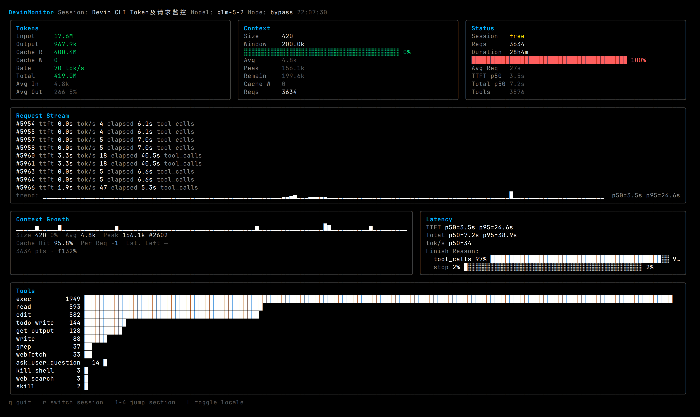
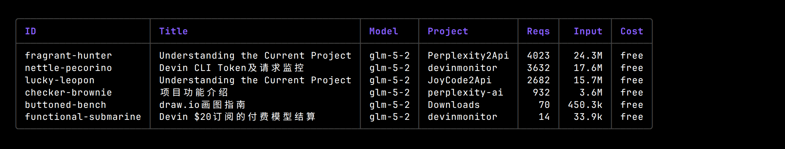
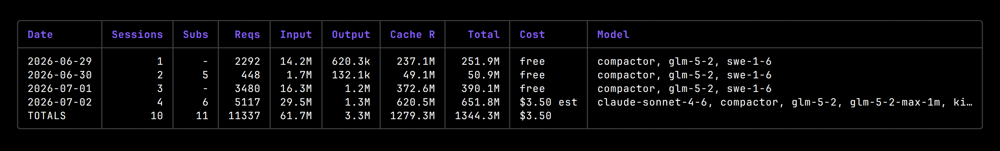
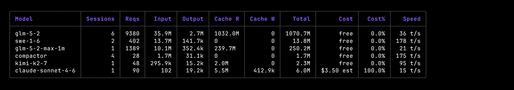
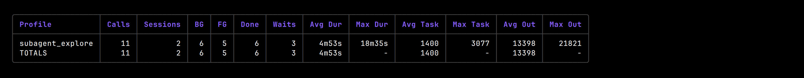

# DevinMonitor

**Token & cost monitor for the [Devin CLI](https://windsurf.com/devin).**

DevinMonitor reads Devin CLI's local session database and provides
real-time monitoring, usage reports, and cost tracking — with
Devin-specific metrics (TTFT, tokens/sec, finish-reason distribution,
context growth, sub-agent usage) that other monitors don't offer.

[中文文档](README.zh-CN.md)

---

## Live dashboard

The `live` command renders a real-time bubbletea TUI that polls
`sessions.db` every few seconds and shows a full at-a-glance view of
the current session:



**Panels:**
- **Tokens** — input / output / cache-read / cache-write totals, live
  generation **rate** (tok/s, summed across concurrent requests over a
  60-second rolling window), and averages.
- **Context** — current context size vs. model window, fill bar,
  average / peak / remaining tokens, cache-write indicator.
- **Status** — session cost, request count (with sub-agent count),
  duration, average request time, TTFT / total p50, total tool calls.
- **Request stream** — scrolling list of recent requests with TTFT,
  tok/s, elapsed, and finish reason, plus a TTFT sparkline with p50/p95.
- **Context growth** — full-session context size history with cache-hit
  ratio.
- **Latency** — TTFT / total / tok/s percentiles and finish-reason
  distribution bar.
- **Tools** — per-tool call counts with horizontal bars, including
  `run_subagent` and `read_subagent` calls.

## Reports

All report commands render styled tables with consistent grey borders
and a `TOTALS` row. Column widths adapt to the terminal; on wide
terminals columns expand, on narrow terminals they truncate gracefully.

### `sessions` — session list



### `session <id>` — session detail

Shows metadata, token breakdown, sub-agent call list (with profile,
task, background/foreground, completion status), and a per-tool call
count breakdown.


### `daily` / `weekly` / `monthly` — time-bucketed usage

Token, request, sub-agent, and cost totals per day / week / month,
with the list of models used. Use `--breakdown` to add a per-model
sub-table. `weekly` supports `--start-day monday|sunday|...`.




### `models` — per-model analytics

Requests, tokens (input / output / cache-read / cache-write), cost,
cost share, and average generation speed per model.



### `model <name>` — model detail

First/last used, days active, token totals, cost, average per day and
per session, p50/p95 TTFT and total time, truncation rate, and a
per-tool breakdown for that model.


### `projects` — per-project usage

Sessions, requests, tokens, cost, and models used, grouped by working
directory's project name.


### `agents` — sub-agent usage statistics

Detailed sub-agent usage grouped by profile: total calls, sessions
involved, background/foreground split, completion count, `read_subagent`
waits, average/max duration, average/max task length, and average/max
output length.



## Install

```bash
go install github.com/garywhat/devinmonitor@latest
```

Or download a pre-built binary from [Releases](../../releases).

Or build from source:
```bash
git clone https://github.com/garywhat/devinmonitor.git
cd devinmonitor
go build -o devinmonitor .
```

## Usage

```bash
# Real-time dashboard (needs a TTY)
devinmonitor live

# Session list
devinmonitor sessions

# Session detail
devinmonitor session fragrant-hunter

# Daily usage with per-model breakdown
devinmonitor daily --breakdown

# Weekly report starting on Monday
devinmonitor weekly --start-day monday --breakdown

# Monthly report
devinmonitor monthly

# Model analytics
devinmonitor models

# Model detail
devinmonitor model glm-5-2

# Per-project usage
devinmonitor projects

# Sub-agent usage statistics
devinmonitor agents

# Prometheus metrics endpoint
devinmonitor metrics --addr :9101

# Export normalized JSON
devinmonitor export --detailed > usage.json
```

### Global flags

```
--data-dir string   Devin data directory (default: auto-detect)
--locale string     Language: en / zh (default: auto-detect from system)
```

### Live dashboard controls

```
q          quit
r          switch to next session
1-4 / Tab  jump to section (compact mode)
L          toggle locale (en <-> zh)
```

## Responsive TUI

The live dashboard adapts to terminal size with four breakpoints:

| Breakpoint | Size | Layout |
|------------|------|--------|
| **Full** | >= 120 cols, >= 24 rows | complete 4-row dashboard |
| **Compact** | 80-119 cols | 2-column + tabbed views |
| **Mini** | < 80 cols | single-column flow for narrow windows / termux |
| **Tiny** | < 6 rows | single-line ticker for tmux splits |

Window resize is handled instantly via bubbletea's `WindowSizeMsg`.

## Data source

DevinMonitor reads `sessions.db` from Devin CLI's data directory:
- **Linux**: `~/.local/share/devin/cli/sessions.db`
- **macOS**: `~/Library/Application Support/devin/cli/sessions.db`
- **Windows**: `%APPDATA%\devin\cli\sessions.db`

Override with `--data-dir` or the `DEVIN_DATA_DIR` environment variable.

The connection is read-only + WAL + `query_only`, so it won't block
Devin CLI's writes.

### Schema adaptation

Devin CLI's SQLite schema is an internal implementation detail that may
change between versions. The `reader` package isolates schema-specific
SQL/JSON parsing behind a version-detected adapter. When Devin CLI
changes its schema, only a new adapter (e.g. `v2.go`) is needed —
reports and UI are unaffected.

## Cost calculation

| Layer | Source | When used |
|-------|--------|-----------|
| Authoritative | `sessions.metadata.total_credit_cost` / `total_acu_cost` | Non-zero (paid models) |
| Estimate | Built-in token x price table | Credit is zero (free models) |
| Future | External pricing API (openrouter etc.) | Planned |

Free models (e.g. `glm-5-2`) show `free` in cost columns.

## Prometheus metrics

The `metrics` command starts an HTTP server (default `:9101`) exposing
Prometheus-format gauges:

- `devinmonitor_sessions_total`
- `devinmonitor_requests_total`
- `devinmonitor_input_tokens_total` / `devinmonitor_output_tokens_total`
- `devinmonitor_cache_read_tokens_total` / `devinmonitor_cache_write_tokens_total`
- `devinmonitor_cost_total`
- `devinmonitor_model_*` — per-model breakdown
- `devinmonitor_project_*` — per-project breakdown

Scrape it with Prometheus or curl:
```bash
devinmonitor metrics &
curl http://localhost:9101/metrics
```

## Architecture

```
sessions.db -> Reader (schema adapter) -> Normalized model types
                                         |-- Report (sessions/daily/weekly/monthly/models/projects/agents)
                                         |-- Live (bubbletea dashboard)
                                         |-- Export (stable JSON for web upload)
                                         |-- Metrics (Prometheus endpoint)
```

The export format (`export_schema: 1`) is independent of Devin's
internal schema, designed as a stable contract for future web-based
sharing (token leaderboards, burn-rate comparisons, etc.).

## Platform & locale

- **Multi-arch**: linux / darwin / windows x amd64 / arm64 (single binary, no CGO)
- **i18n**: English + 中文, auto-detected from system `LANG` / `LC_ALL`
- **CJK rendering**: correct character width via go-runewidth

## Tech stack

- **Go** — single binary, no runtime dependencies
- **bubbletea + lipgloss** — responsive TUI framework
- **modernc.org/sqlite** — pure-Go SQLite (no CGO, cross-compile friendly)
- **cobra** — CLI command framework

## License

MIT
