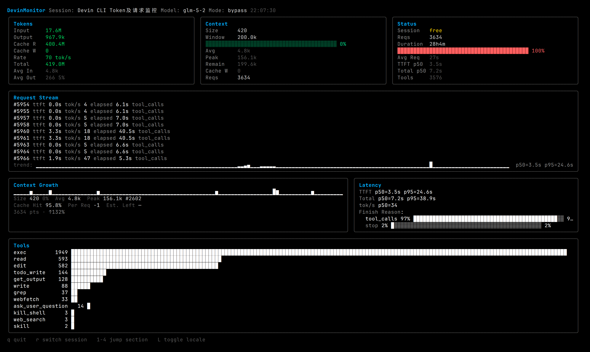
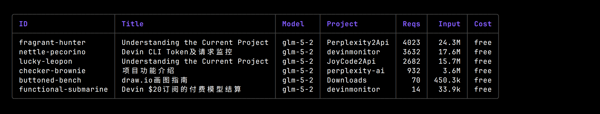
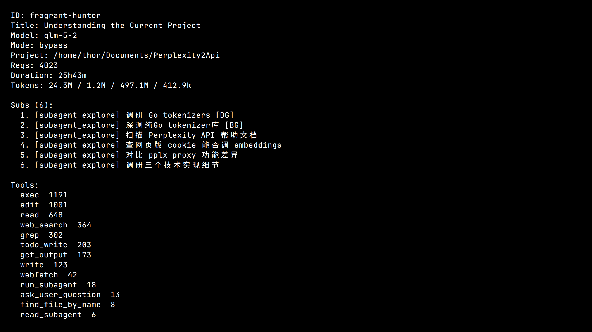
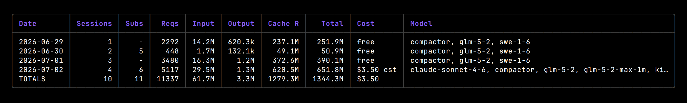
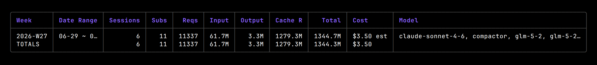
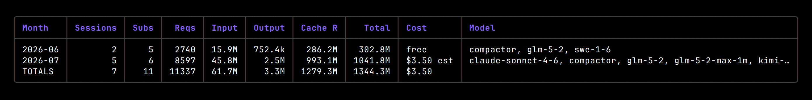
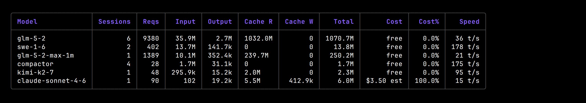
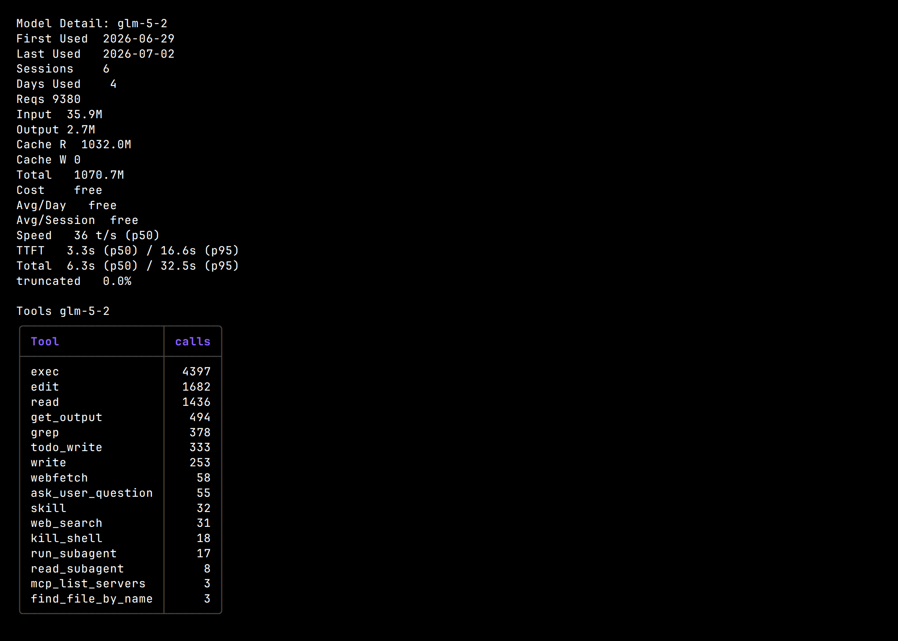
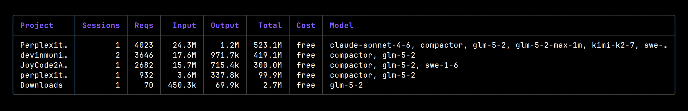
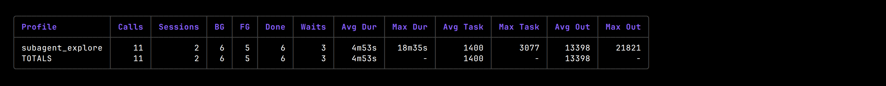

# DevinMonitor

**Token & cost monitor for the [Devin CLI](https://windsurf.com/devin).**

DevinMonitor reads Devin CLI's local session database and provides
real-time monitoring, usage reports, and cost tracking — with
Devin-specific metrics (TTFT, tokens/sec, finish-reason distribution,
context growth, sub-agent usage) that other monitors don't offer.

Everything stays on your machine. The database is opened read-only, reports
run offline, and nothing is uploaded: the local dashboard (`web`) binds the
loopback address, and the only artifact meant to leave your machine is the
sanitised file you choose to produce with `share`.

[中文文档](README.zh-CN.md)

---

## Live dashboard

The `live` command renders a real-time bubbletea TUI that polls
`sessions.db` (every 500 ms by default) and shows a full at-a-glance
view of the current session:



**Panels:**
- **Tokens** — input / output / cache-read / cache-write totals, live
  generation **rate** (tok/s, summed across concurrent requests over a
  60-second rolling window), and averages.
- **Context** — current context size vs. model window, fill bar,
  average / peak / remaining tokens, cache-write indicator.
- **Status** — session cost, request count (with sub-agent count),
  duration, average request time, TTFT / total p50, total tool calls.
- **Request stream** — scrolling list of recent requests with TTFT,
  tok/s, elapsed, and finish reason, plus a TTFT sparkline with p50/p95.
- **Context growth** — full-session context size history with cache-hit
  ratio.
- **Latency** — TTFT / total / tok/s percentiles and finish-reason
  distribution bar.
- **Tools** — per-tool call counts with horizontal bars, including
  `run_subagent` and `read_subagent` calls.

Polling is incremental: after the first load only sessions whose message
count changed are re-read, so a short interval stays cheap even on a
database with tens of thousands of messages.

**`--interval`** sets the refresh interval in **milliseconds** (default
`500`, minimum `100`). When the flag is omitted the `refreshInterval`
config value is used; an explicit flag always wins. The same interval
applies to the extended dashboard (`--light` / `--once` / `--theme`).

## Reports

All report commands render styled tables with consistent grey borders
and a `TOTALS` row. Column widths adapt to the terminal; on wide
terminals columns expand, on narrow terminals they truncate gracefully.

### `sessions` — session list



### `session <id>` — session detail

Shows metadata, token breakdown, sub-agent call list (with profile,
task, background/foreground, completion status), and a per-tool call
count breakdown.



### `daily` / `weekly` / `monthly` — time-bucketed usage

Token, request, sub-agent, and cost totals per day / week / month,
with the list of models used. Use `--breakdown` to add a per-model
sub-table, and `--last N` to show only the N most recent periods
(`--last 0`, the default, means all of them). `weekly` supports
`--start-day monday|sunday|...`.







### `models` — per-model analytics

Requests, tokens (input / output / cache-read / cache-write), cost,
cost share, and average generation speed per model.



### `model <name>` — model detail

First/last used, days active, token totals, cost, average per day and
per session, p50/p95 TTFT and total time, truncation rate, and a
per-tool breakdown for that model.



### `projects` — per-project usage

Sessions, requests, tokens, cost, and models used, grouped by working
directory's project name.



### `agents` — sub-agent usage statistics

Detailed sub-agent usage grouped by profile: total calls, sessions
involved, background/foreground split, completion count, `read_subagent`
waits, average/max duration, average/max task length, and average/max
output length.



### `export [report_type]` — machine-readable reports

`export` writes any report to a file or stdout in four formats. The
optional report type defaults to `sessions`:

```bash
devinmonitor export                       # sessions, rich JSON (schema 1)
devinmonitor export daily --format csv
devinmonitor export weekly --format markdown --output weekly.md
devinmonitor export models --format html  > models.html
devinmonitor export projects --format json
```

| Report type | Contents |
|---|---|
| `sessions` (default) | Full normalized document (`export_schema: 1`), a stable **local** contract for scripts and diffing |
| `daily` / `weekly` / `monthly` | Time buckets with cost, tokens, requests, cache ratio |
| `models` | Per-model totals, cost, TTFT and throughput percentiles |
| `projects` | Per-project totals keyed by working directory |
| `agents` | Sub-agent usage grouped by profile |

Formats: `csv`, `markdown`, `html`, `json`. An unknown report type or
format exits non-zero with a usage hint. `--detailed` still embeds the
per-request detail in the `sessions` document.

### `web` — local-only HTML dashboard

`web` serves a live HTML dashboard over HTTP, bound to **`127.0.0.1` only** —
never `0.0.0.0` or any external address — so it answers on your machine and is
not reachable from the network. It reads the same local `sessions.db`, shows
cost KPIs, a session table, alerts and a cost chart, and streams updates over
server-sent events. It **sends nothing anywhere**: no upload, no hosted
sharing, no public leaderboard, no telemetry.

```bash
devinmonitor web                 # http://127.0.0.1:8080
devinmonitor web --port 9090     # pick a different loopback port
```

**`web` vs `share`:** `web` renders your real, unsanitised data, so it includes
local project paths, session titles and session IDs. It is for *your* screen.
To send a report to someone else, use `share --format html`: aggregate-only,
self-contained, and accompanied by the redaction manifest. Browse locally with
`web`; publish a sanitised artifact with `share`.

### `share` — a sanitised report safe to send to someone else

`share` writes an **aggregate-only** report: no absolute paths (projects are
reduced to their last path segment), no session IDs, no error text, no message
content. It prints the redaction manifest it applied, and `--dry-run` shows
what would be removed before anything is written.

```bash
devinmonitor share --dry-run                      # review the redactions first
devinmonitor share                                # JSON to stdout
devinmonitor share --output report.json           # JSON to a file
devinmonitor share --format html --output report.html
devinmonitor share --include-errors               # add error-category counts
```

`--format html` produces a **self-contained page**: inline CSS, no JavaScript,
no external font, image or stylesheet, so it renders correctly from disk with
the network switched off. It carries the same aggregate figures as the JSON
plus the redaction manifest, so a recipient can audit what was removed.

## Command reference

`devinmonitor --help` lists **60 commands** in 12 groups; cobra's own `help` and
`completion` are not counted. This section documents all 60 — ten commands get
their own short entry, then one table per group. Every description comes from
the command's `--help` or from running it.

### Ten commands to learn first

**`filter` — narrow the session list.** Select sessions by model, project, agent
mode and date, with sorting:

```bash
devinmonitor filter --model swe --project api --from-date 2026-09-01 --sort cost
devinmonitor filter --exclude scratch --mode plan --json
```

`--mode` accepts `normal`, `plan` or `bypass`; `--sort` accepts
`cost|tokens|context|duration|recent`. `--json` emits the same rows as
`sessions --json`.

**`cost` — the money overview.** `devinmonitor cost` prints one panel with total
cost, sessions, requests, tokens, active days, the cache split and the models
involved. It takes no flags and has no `--json`; for scripts read
`snapshot --json` instead.

**`blocks` — 5-hour billing windows.** `devinmonitor blocks` groups usage into
Devin's billing windows (5h by default) with tokens, cost and a `done`/`gap`
status per window, plus burn rate and projection for the active one.

```bash
devinmonitor blocks --active          # just the live window
devinmonitor blocks --window 2h --json
```

`--since`/`--until` take `YYYY-MM-DD`; `--limit-tokens` sets the active window's
token ceiling; `--compact` fits narrow terminals.

**`budget` — thresholds and guardrails.** `devinmonitor budget` shows
daily/weekly/monthly spend against the budgets from `config`, as gauges with
status. It is a warning surface, not an enforcement point: spending caps are
applied by Devin, not here.

**`top-cost` — the most expensive sessions.** `devinmonitor top-cost --limit 20`
lists the priciest sessions with requests and cost; the default limit is 10.

**`snapshot` — the one-document status.** `devinmonitor snapshot --json` is the
machine-readable status: `schemaVersion`, active sessions, cost windows, limits
and the breakdown. The same data drives a status bar or a CI check:

```bash
devinmonitor snapshot --compact               # one ANSI-free line
devinmonitor snapshot --exit-code             # 0/10/11/20/30, see below
devinmonitor snapshot --write-state           # atomic state file for a dashboard
```

`--statusline` prints one line and can capture an upstream `rate_limits` payload
from stdin; `--limit-tokens` / `--limit-acu` set the active window's ceilings.
The `--exit-code` values are `0` ok, `10` near limit, `11` limit hit,
`20` indeterminate and `30` no data.

**`cache` — what the prompt cache is buying you.** `devinmonitor cache` shows
cache-read / cache-write / input tokens, the hit ratio and its donut, the implied
savings, and the leverage factor (how much prompt volume was served from cache).

**`optimize` — waste patterns.** `devinmonitor optimize --days 30` scans for
concrete waste — re-edit loops, files read dozens of times, configuration that is
never used — and prints each finding with its impact and a suggestion. It only
reports; it changes nothing.

**`backup` — take the data with you.** `devinmonitor backup` writes the
normalized dataset as JSON; `devinmonitor backup --db --output sessions.db`
copies the raw SQLite file instead.

**`trends` — direction, not just totals.** `devinmonitor trends --range week`
draws a daily cost chart with the delta since the last check;
`--days 7|30|90` overrides `--range week|month|all`.

### Machine-readable output (`--json`)

Nine commands have a `--json` form:

| Command | What the JSON carries |
|---|---|
| `sessions` | array of session rows: `id`, `title`, `model`, `project`, `cost`, `tokens`, `duration`, `status` |
| `filter` | the same rows, after filtering |
| `search` | array of matches: `SessionID`, `NodeID`, `Role`, `Snippet`, `Timestamp` |
| `blocks` | array of billing windows: `id`, `startTime`/`endTime`, `isActive`, `isGap`, `models`, `cost`, `tokens`, `totalTokens`, `nonCacheTokens`, `usedPercent` |
| `errors` | object: `total`, `assistantMessages`, `errorRate`, `byCategory`, `findings` |
| `report` | object: `Window`, `From`, `To`, `Sessions`, `Requests`, `InputTok`, `OutputTok`, `Cost`, `Daily` |
| `status` | object: `generated_at`, `today_cost`, `month_cost`, `cost_basis` (plus `today_basis`/`month_basis`), `sessions` |
| `snapshot` | object: `schemaVersion`, `generatedAt`, `status`, `limits`, `breakdown` |
| `alerts` | array of alerts: `kind`, `severity`, `message` |

Cost & Budget is the gap: apart from `blocks`, the commands `cost`, `budget`,
`burn-rate`, `projection`, `top-cost`, `plan` and `currency` have **no `--json`**
output. Scripts should read those figures from `snapshot --json` instead.

### Commands by group

#### Live & TUI

| Command | What it does | Key flags | `--json` |
|---|---|---|---|
| `live` | Real-time bubbletea dashboard; `--demo` runs on synthetic data, `--once` prints a single frame | `--interval` (ms, default 500), `--light`, `--theme`, `--once`, `--demo` | — |
| `theme` | List, switch or show the built-in TUI palettes (`list`, `set <name>`, `show`) | — | — |
| `replay` | Step through one session's messages in chronological order (`replay <session-id>`) | `--data-dir` | — |
| `timeline` | Colour-coded visual timeline of one session's events (`timeline <session-id>`) | `--data-dir` | — |

#### Sessions

| Command | What it does | Key flags | `--json` |
|---|---|---|---|
| `sessions` | Session list with cost and tokens; `--verbose` adds every column | `--sort`, `--verbose`, `--watch`, `--interval` (s), `--save` | ✅ |
| `session` | Detail for one session (`session <id>`): metadata, token split, sub-agent calls, per-tool counts | — | — |
| `filter` | Filter sessions by model, project, mode and date, with sorting | `--model`, `--project`, `--exclude`, `--mode`, `--from-date`, `--to-date`, `--sort` | ✅ |
| `search` | Full-text search across all session messages (`search <query>`) | `--limit` (default 50) | ✅ |

#### Time reports

| Command | What it does | Key flags | `--json` |
|---|---|---|---|
| `daily` | Daily usage buckets, with `--today` and `--watch` for a live view | `--breakdown`, `--last`, `--today`, `--watch`, `--interval` (s) | — |
| `weekly` | Weekly buckets | `--breakdown`, `--last`, `--start-day` | — |
| `monthly` | Monthly buckets | `--breakdown`, `--last` | — |
| `24h` | Hourly activity chart for the last 24 hours (`24h`) | — | — |

#### Cost & budget

| Command | What it does | Key flags | `--json` |
|---|---|---|---|
| `cost` | Cost overview: totals, sessions, requests, tokens, active days, models | — | — |
| `budget` | Daily/weekly/monthly budget status with guardrails and gauges | — | — |
| `burn-rate` | Spending velocity per hour/day/week/month, extrapolated | — | — |
| `projection` | Predicted month-end spend and days to budget exhaustion, with confidence | — | — |
| `top-cost` | The most expensive sessions | `--limit` (default 10) | — |
| `plan` | Show or configure the Devin subscription plan and ACU limit (`show`, `set`) | — | — |
| `currency` | Show, set or reset the display currency (`show`, `set <code>`, `reset`) | — | — |
| `blocks` | Usage grouped into billing windows, with burn rate and projection | `--active`, `--window`, `--since`, `--until`, `--limit-tokens`, `--compact` | ✅ |

#### Analytics

| Command | What it does | Key flags | `--json` |
|---|---|---|---|
| `cache` | Cache hit ratio, efficiency donut, savings and leverage | — | — |
| `efficiency` | Token efficiency score, output verbosity, one-shot rate and productivity | — | — |
| `tasks` | Task category breakdown (coding, debugging, testing, …) | — | — |
| `optimize` | Scan for waste patterns and print optimization suggestions | `--days` (default 30) | — |
| `compaction` | Detect context compaction events from token-count drops | — | — |
| `context` | Analyse what fills one session's context window (`context <session-id>`) | — | — |
| `analytics` | Combined overview: cache, efficiency, tasks, waste, compaction | `--days` | — |
| `model-compare` | Compare models side by side on cost, tokens, latency, cache hit and speed | — | — |
| `yield` | Productive versus abandoned spend, correlated with Git commits | `--days` (default 30) | — |
| `errors` | Tool errors by category, with optional example messages | `--examples N`, `--session` | ✅ |

#### Trends & charts

| Command | What it does | Key flags | `--json` |
|---|---|---|---|
| `trends` | Cost and usage trend chart | `--range` (week/month/all), `--days` | — |
| `heatmap` | Weekday × hour activity heatmap | — | — |
| `calendar` | Full-year contribution calendar | `--year` | — |
| `compare` | Compare two periods side by side, or month over month | `--mode`, `--current`, `--previous` | — |

#### Projects & tools

| Command | What it does | Key flags | `--json` |
|---|---|---|---|
| `projects` | Per-project totals: sessions, requests, tokens, cost, models | `--attribution` | — |
| `project` | Drill-down for one project (`project <name>`): daily, model and tool breakdown | `--days` (default 30), `--detail` | — |
| `tools` | Tool cost attribution (cost distributed across tools) | `--session`, `--all` (default true) | — |
| `mcp-stats` | Usage broken down by MCP server | — | — |
| `shell-usage` | `exec` / `shell_command` usage by command category | — | — |
| `activities` | Usage broken down by activity type (coding, debugging, testing, …) | — | — |
| `git` | Correlate sessions with Git commits in their working directory | `--days` (default 30), `--session` | — |

#### Models & agents

| Command | What it does | Key flags | `--json` |
|---|---|---|---|
| `models` | Per-model analytics; `--verbose` adds latency columns (TTFT, total, truncation %) | `--verbose` | — |
| `model` | Detail for one model (`model <name>`): first/last use, days active, p50/p95 TTFT, truncation, per-tool | — | — |
| `agents` | Sub-agent usage by profile: calls, foreground/background, completion, durations, task and output size | — | — |

#### Export & backup

| Command | What it does | Key flags | `--json` |
|---|---|---|---|
| `export` | Write any report as `csv`, `markdown`, `html` or `json` (`export [report_type]`) | `--format`, `--output`, `--detailed` | JSON is the format |
| `report` | Shareable usage report as text or an SVG chart | `--days` (default 7), `--month`, `--svg` | ✅ |
| `backup` | Back up everything: normalized JSON, or the raw database with `--db` | `--db`, `--output` | — |
| `status` | Compact status line, shell number, atomic state file or terminal title | `--compact`, `--shell`, `--json`, `--write-state`, `--state-file`, `--set-title`, `--title-format` | ✅ |
| `share` | Sanitised, aggregate-only report safe to send (see above) | `--dry-run`, `--format`, `--output`, `--include-errors` | JSON is the default format |

#### Integration

| Command | What it does | Key flags | `--json` |
|---|---|---|---|
| `mcp` | MCP server over stdio (JSON-RPC 2.0), exposing tools and resources | — | MCP, not CLI JSON |
| `web` | Local-only HTML dashboard on `127.0.0.1` (see above) | `--port` | — |
| `notify` | Send a desktop or webhook notification about current alerts (`--test` sends a test one) | `--test` | — |
| `snapshot` | Current snapshot: active sessions, costs, limits (see above) | `--compact`, `--json`, `--exit-code`, `--statusline`, `--write-state`, `--limit-acu`, `--limit-tokens` | ✅ |
| `alerts` | Current alerts, intended for agent consumption | — | ✅ |

#### Config & data

| Command | What it does | Key flags | `--json` |
|---|---|---|---|
| `config` | View and edit configuration (`show`, `schema`, `set <key> <value>`, `reset`, `timezone`, `reset-hour <hour>`, `model-alias`) | — | — |
| `alias` | Manage command aliases (`list`, `add <short> <long>`, `remove <short>`) | — | — |
| `pricing` | Manage custom price overrides in USD per million tokens (`list`, `overrides`, `set <model>`, `remove <model>`, `validate`, `schema`, `fetch`, `cache`) | `--input`, `--output`, `--cache-read`, `--cache-write`, `--free`, `--file`, `--source`, `--force` | — |
| `warehouse` | Manage the local time-series warehouse (`snapshot`, `list`, `show <id>`) | — | — |

#### System

| Command | What it does | Key flags | `--json` |
|---|---|---|---|
| `metrics` | Prometheus metrics endpoint | `--addr` (default `:9101`) | Prometheus text format |
| `version` | Print the version | — | — |

## MCP server

`devinmonitor mcp` runs a Model Context Protocol server over stdio, so
an MCP client (Claude Desktop, Cursor, …) can query your local usage
data directly. It speaks both stdio framings — the spec's
`Content-Length` framing and bare newline-delimited JSON — and supports
JSON-RPC batching, notifications, and `ping`.

Tools exposed:

| Tool | Purpose |
|---|---|
| `get_sessions` | Session list with cost and token usage |
| `get_session` | Detail for one session by ID |
| `get_cost_summary` | Aggregated cost (today / week / month / total) |
| `get_alerts` | Budget thresholds and idle sessions |
| `get_blocks` | Usage grouped by 5-hour billing window |
| `get_limits` | Current window status, pace and forecast |
| `compare_periods` | Compare two periods (defaults to month over month) |
| `list_reports` | Available report types and export formats |

Protocol behaviour is locked down end-to-end by `scripts/mcp-conformance.sh`,
which drives the real binary over stdio with the spec's framing and reports a
per-generation case count. It covers both protocol generations the server
speaks — **legacy** (the `initialize` handshake, revision `2024-11-05`) and
**modern** (stateless per-request `_meta`, revision `2026-07-28`:
`server/discover`, `resultType` on every result, `ttlMs`/`cacheScope` on list
and read results, and `UnsupportedProtocolVersionError` when a client asks for
a version we do not serve).

Read-only **resources** are also available under the `devinmonitor://`
scheme, so a client can pull a summary without calling a tool:

| Resource | Contents |
|---|---|
| `devinmonitor://summary` | Cost, token, request and session totals, with cost provenance |
| `devinmonitor://models` | Per-model usage table with share of tokens |
| `devinmonitor://blocks` | Open billing window with burn rate and projection |
| `devinmonitor://alerts` | Current alerts grouped by kind |

```json
{
  "mcpServers": {
    "devinmonitor": { "command": "devinmonitor", "args": ["mcp"] }
  }
}
```

## Install

```bash
go install github.com/garywhat/devinmonitor@latest
```

Or download a pre-built binary from [Releases](../../releases).

Or build from source:
```bash
git clone https://github.com/garywhat/devinmonitor.git
cd devinmonitor
go build -o devinmonitor .
```

## Usage

```bash
# Real-time dashboard (needs a TTY)
devinmonitor live

# Faster refresh: 200 ms (milliseconds, minimum 100)
devinmonitor live --interval 200

# Session list
devinmonitor sessions

# Session detail
devinmonitor session fragrant-hunter

# Daily usage with per-model breakdown
devinmonitor daily --breakdown

# Weekly report starting on Monday
devinmonitor weekly --start-day monday --breakdown

# Monthly report
devinmonitor monthly

# Model analytics
devinmonitor models

# Model detail
devinmonitor model glm-5-2

# Per-project usage
devinmonitor projects

# Sub-agent usage statistics
devinmonitor agents

# Prometheus metrics endpoint
devinmonitor metrics --addr :9101

# Export normalized JSON
devinmonitor export --detailed > usage.json

# Export a specific report type: sessions|daily|weekly|monthly|models|projects|agents
devinmonitor export weekly --format markdown --output weekly.md

# MCP server over stdio (Claude Desktop / Cursor)
devinmonitor mcp

# Local web dashboard (127.0.0.1 only; sends nothing)
devinmonitor web
```

### Global flags

```
--data-dir string   Devin data directory (default: auto-detect)
--locale string     Language: en / zh (default: auto-detect from system)
--no-cost           Hide cost columns in every table (for screenshots and sharing)
```

`--no-cost` is a persistent flag, so it works before or after the
subcommand: `devinmonitor --no-cost sessions` and
`devinmonitor sessions --no-cost` are equivalent. It removes the cost
and cost-percentage **table columns**; cost figures printed inside panels
and popups are not affected.

### Live dashboard controls

```
q          quit
r          switch to next session
1-4 / Tab  jump to section (compact mode)
L          toggle locale (en <-> zh)
```

The extended dashboard (`--light` / `--theme`) adds:

```
s          settings panel (theme, refreshInterval, budgets, currency)
?          help overlay
Ctrl+P     command palette
Enter      session detail popup
m          model breakdown popup
|          split pane (list + details)
v          toggle list / card-grid view
t          cycle time window (today / week / month / all)
l          live log tail of recent messages
```

## Upgrade notes — v0.3.0

- **`live --interval` now takes milliseconds**, not seconds. The old
  `--interval 3` meant 3 seconds; use `--interval 3000`. The minimum is
  `100` and the default is `500`.
- **`refreshInterval` config is now honoured** (in milliseconds) and is
  used whenever `--interval` is omitted; its default changed from `3`
  to `500`.
- **`--data-dir` is authoritative**: pointing it at a directory without
  `sessions.db` now fails with a clear error instead of silently
  falling back to the auto-detected database.
- **`compare --mode` rejects unknown values** instead of silently
  treating them as `custom`.
- `export` accepts an optional report type (`export weekly --format
  csv`); running it with no argument is unchanged.
- Sub-agent durations are capped at the session lifetime, so bogus
  multi-year values no longer appear.

## Responsive TUI

The live dashboard adapts to terminal size with four breakpoints:

| Breakpoint | Size | Layout |
|------------|------|--------|
| **Full** | >= 120 cols, >= 28 rows | complete 4-row dashboard |
| **Compact** | 80-119 cols | 2-column + tabbed views |
| **Mini** | < 80 cols | single-column flow for narrow windows / termux |
| **Tiny** | < 6 rows | single-line ticker for tmux splits |

Window resize is handled instantly via bubbletea's `WindowSizeMsg`.

## Data source

DevinMonitor reads `sessions.db` from Devin CLI's data directory:
- **Linux**: `~/.local/share/devin/cli/sessions.db`
- **macOS**: `~/Library/Application Support/devin/cli/sessions.db`
- **Windows**: `%APPDATA%\devin\cli\sessions.db`

Override with `--data-dir` or the `DEVIN_DATA_DIR` environment variable.

The connection is read-only + WAL + `query_only`, so it won't block
Devin CLI's writes.

### What is read today — and what is not

The figures in this tool come from `sessions.db` **only**. Devin CLI also writes
`transcripts/*.json` (ATIF-v1.7 trajectories carrying `final_metrics` and
per-step `steps`), and Devin Desktop can emit ACP event streams. Neither is
ingested yet: they are candidate future sources, not current ones, so a figure
shown here reflects `sessions.db` and nothing else.

### Schema adaptation

Devin CLI's SQLite schema is an internal implementation detail that may
change between versions. The `reader` package isolates schema-specific
SQL/JSON parsing behind a version-detected adapter. When Devin CLI
changes its schema, only a new adapter (e.g. `v2.go`) is needed —
reports and UI are unaffected.

## Cost calculation

| Layer | Source | When used |
|-------|--------|-----------|
| Authoritative | `sessions.metadata.total_credit_cost` / `total_acu_cost` | Non-zero (paid models) |
| User override | `<config dir>/pricing.json` | When set for the model (wins over the built-in table) |
| Estimate | Built-in token x price table | Credit is zero (free models) |

Free models (e.g. `glm-5-2`) show `free` in cost columns.

Pricing is resolved locally and never fetched at read time. If a remote price
source is ever added it must **write** into `pricing.json` rather than being
consulted during a report, so the tool stays usable offline and the no-network
invariant holds.

### Cost units: ACU vs tokens (`costBasis`)

Devin bills in **ACU** (action complexity plus VM time), and ACU has **no
definitional relation to tokens** — no exchange rate, no formula, no conversion.
That matters here because the tool prints two kinds of money figure that look
alike:

| Figure | Where it comes from | What it is measured in |
|---|---|---|
| `sessions.metadata.total_credit_cost` / `total_acu_cost` | Devin's own accounting, read from `sessions.db` | the provider's ACU / credit basis |
| token × price (built-in table, `pricing.json` or a fetched catalogue) | our local estimate | USD per million tokens |

`provenance` (`official` / `estimated` / `mixed` / `unknown`) answers *is this an
estimate?* — it does **not** say what the number is measured in. An ACU-derived
figure and a token-derived figure are **not comparable**, and a report that mixed
them silently would invite a wrong comparison.

A sibling field, **`costBasis`**, answers *what is it measured in?*:

| Value | Meaning |
|---|---|
| `acu` | the figure comes from Devin's own ACU/credit accounting (`total_acu_cost` / `total_credit_cost`); the only basis that reflects what Devin bills |
| `token_estimate` | the figure is our arithmetic: token counts × our model price table. A free or unpriced model lands here too — the figure is `0` from *our* arithmetic even when Devin reports token counts. Official token counts are not an ACU figure |
| `mixed` | the figure adds ACU-billed and token-estimated costs together: one currency, but not one unit |
| `unavailable` | no basis could be established (no cost signal and no token counts) |

`costBasis` travels with the figure. It appears as `breakdown.costBasis` — and
per model row as `breakdown.byModel[].costBasis` — in `snapshot --json`; as
`cost_basis` plus `today_basis` / `month_basis` in `status --json` and in the
`--write-state` file; and as `usage.costBasis`, with per-model and per-project
rows in `usage.byModel[]` / `usage.byProject[]`, in `share`. It sits beside the
provenance label (`breakdown.costProvenance` in the snapshot,
`usage.costProvenance` in share), and the two are meant to be read as a pair:
first `costBasis` (which unit), then provenance (how trustworthy). Consumers
should branch on `costBasis` before comparing or summing cost figures, and treat
a `mixed` figure as explicitly not comparable across its parts. `export` carries
the same label in that document's snake_case spelling — `cost_basis` per session
and once for the document — alongside the raw components `acu_cost` /
`credit_cost` / `estimated_cost`, so a consumer never has to re-implement the
precedence rule that decides which one is "the" cost; a session row is never
`mixed`, because one session's figure comes from one meter. (`backup` wraps the
same document.)

One apparent disagreement is not one: on a free-tier machine the basis can
honestly be `token_estimate` while provenance reads `unknown` — provenance says
"we do not vouch for the price we applied", basis says "this number is our token
arithmetic, not Devin's ACU meter".

Human surfaces tag every figure, so a number never appears without its unit:

| Tag | Meaning |
|---|---|
| `[acu]` | Devin's own meter |
| `[token est]` | our token counts × model prices |
| `[mixed units]` | ACU-billed and token-estimated costs added together |
| `[no basis]` | no basis could be established |

```
$ devinmonitor status
Today:     $0.00 [token est]
Month:     $0.00 [token est]
Sessions:  18
Cost basis: token est — our token counts × model prices, not Devin's meter. Devin bills in
            ACU (action complexity + VM time), a different unit with no conversion to tokens:
            do not compare a token estimate with an acu figure.
```

`status --compact` and `snapshot --compact` carry the same tags, and whenever a
figure mixes both meters the legend says `MIXED UNITS` and spells out that
ACU-billed and token-estimated costs were added together. `report` prints the
legend under its `Cost:` line, and `share --format html` has a "Cost basis" row
plus a basis column on both of its tables.

### Editor autocomplete for `config.json`

`devinmonitor config schema` prints the schema URL, the resolved config-file
path, and the local `docs/config.schema.json` when it is checked out. Add the
`$schema` key to your `config.json` and your editor will autocomplete and
validate it — including the theme enum, so a palette you never registered is
rejected as you type rather than silently ignored:

```json
{ "$schema": "https://raw.githubusercontent.com/garywhat/devinmonitor/main/docs/config.schema.json" }
```

The schema forbids unknown keys, so a typo fails loudly. `pricing.json` has its
own separate schema; see below.

### Remote price catalogue (opt-in)

`devinmonitor pricing fetch` downloads a public model catalogue (OpenRouter's
model list by default) and caches it at `<config dir>/pricing.cache.json` for
offline use. Three properties matter:

- **Off by default.** Nothing reaches the network unless you run `pricing fetch`,
  or set `config set pricingAutoFetch true` to refresh it at most once every 24h.
- **Downloads only.** The request is a bare `GET` for a public price list; no
  usage data, model names or paths are sent.
- **Never consulted at read time.** Prices are resolved from local files.

Precedence is **your `pricing.json` > the fetched cache > the built-in table**,
so a refresh can never overwrite a price you set. The cache is written to its own
file for exactly that reason. `pricing cache` shows its state, and
`DEVINMONITOR_OFFLINE=1` forbids fetching entirely.

## Prometheus metrics

The `metrics` command starts an HTTP server (default `:9101`) exposing
Prometheus-format gauges:

- `devinmonitor_sessions_total`
- `devinmonitor_requests_total`
- `devinmonitor_input_tokens_total` / `devinmonitor_output_tokens_total`
- `devinmonitor_cache_read_tokens_total` / `devinmonitor_cache_write_tokens_total`
- `devinmonitor_cost_total`
- `devinmonitor_model_*` — per-model breakdown
- `devinmonitor_project_*` — per-project breakdown

Scrape it with Prometheus or curl:
```bash
devinmonitor metrics &
curl http://localhost:9101/metrics
```

## Architecture

```
sessions.db -> Reader (schema adapter) -> Normalized model types
                                         |-- Report (sessions/daily/weekly/monthly/models/projects/agents)
                                         |-- Live (bubbletea dashboard)
                                         |-- Export (stable local JSON contract)
                                         |-- Web (loopback-only HTML dashboard)
                                         |-- Metrics (Prometheus endpoint)
```

The export format (`export_schema: 1`) is independent of Devin's internal
schema and is designed as a stable **local** contract for scripts, CI jobs and
diffing two periods — not as an upload format. Nothing in DevinMonitor sends
usage data anywhere. To hand a report to another person, use the sanitised
`share` output described above.

## How this compares

DevinMonitor is a Devin-specific instrument, not a broad multi-agent tracker.
The projects below are good at what they do — and several of them read Devin
data too — so the differences here are scope and depth, not quality.

| Tool | What it does | Where we differ |
|---|---|---|
| [ccusage](https://github.com/ccusage/ccusage) | Local token and cost reports for 18 agent CLIs, with `daily`/`weekly`/`monthly`/`session`/`blocks` subcommands and `--json` | It covers many agents; we read Devin only. We add Devin-specific latency (TTFT, tokens/sec percentiles), finish-reason and per-tool cost attribution that are not part of its documented report set |
| [tokscale](https://github.com/junhoyeo/tokscale) | TUI plus web contribution graphs for 50+ agents, including Devin CLI via `~/.local/share/devin/cli/sessions.db` and Devin Desktop ACP events; optional `submit` to a global leaderboard | It already reads the same database we do. We go deeper on that single source (latency/throughput distributions, context growth, sub-agent statistics), and we deliberately ship no leaderboard or upload path |
| [codeburn](https://github.com/getagentseal/codeburn) | 40 tools with terminal, desktop, menu-bar and browser surfaces, MCP tools, a `quota` command and LAN multi-machine merge; its [Devin provider notes](https://github.com/getagentseal/codeburn/blob/main/docs/providers/devin.md) read `transcripts/*.json` as the usage source with `sessions.db` as enrichment | It is far broader and already ingests Devin transcripts, which we do not yet. We are one static binary with no account and no GUI, and we offer a sanitised `share` artifact with an auditable redaction manifest instead of a hosted dashboard |
| [sniffly](https://github.com/chiphuyen/sniffly) | Web analysis of Claude Code logs with error classification and one-click share links ([sniffly.dev](https://sniffly.dev)) | It covers Claude Code; we cover Devin. Its share links are hosted (private or public gallery); ours stay a local file with a redaction manifest you can inspect |
| [Claude-Code-Usage-Monitor](https://github.com/Maciek-roboblog/Claude-Code-Usage-Monitor) | Real-time Claude Code monitor that reads the provider's own `rate_limits`, keeps a persistent warehouse, and supports `--once --output json` with semantic exit codes | It can trust an official provider window; our numbers are derived from local data and carry cost provenance (`official`/`estimated`/`unknown`). We add Devin metrics and an MCP surface it does not document |
| [devin-usage](https://github.com/Meltemi-Q/devin-usage) | Devin-specific: its README documents reading Devin's server-side seat quota and org ACU spend (undocumented web/API surfaces) alongside local `sessions.db` metrics | It reports the quota truth we cannot: our windows and costs are derived from local data and labelled as such. Its quotas come from reverse-engineered endpoints its own README flags as changeable, so we treat that route as optional future work rather than a default path |

Where we go deeper on Devin specifically: TTFT and tokens/sec percentiles,
finish-reason distribution, context growth with cache-hit ratio, sub-agent call
statistics, 5-hour billing blocks with burn rate and projection, provenance
labels on every cost figure, 8 MCP tools plus 4 read-only resources, semantic
exit codes for scripting, and a sanitised `share` artifact. All of it is local:
no account, no upload, no telemetry.

What we do not have, stated plainly:

- **Multi-agent breadth.** ccusage (18 sources), tokscale (50+) and codeburn (40
  tools) cover many CLIs; DevinMonitor reads Devin only.
- **Transcript ingestion.** codeburn reads Devin's ATIF transcripts
  (`~/.local/share/devin/cli/transcripts/*.json`) as its primary usage source.
  We read `sessions.db` today and do not ingest transcripts or ACP events yet.
- **Desktop and menu-bar surfaces.** codeburn ships desktop, menu-bar and
  browser UIs; DevinMonitor is a CLI/TUI plus machine-readable interfaces.
- **Server-side quota truth.** Claude-Code-Usage-Monitor can read the
  provider's own rate-limit window, and devin-usage's README documents reading
  Devin's own seat quota and ACU spend; we have no server-side Devin quota
  source and do not transmit credentials to invent one.

The links above are the sources for each comparison claim.

## Platform & locale

- **Multi-arch**: linux / darwin / windows x amd64 / arm64 (single binary, no CGO)
- **i18n**: English + 中文, auto-detected from system `LANG` / `LC_ALL`
- **CJK rendering**: correct character width via go-runewidth

## Tech stack

- **Go** — single binary, no runtime dependencies
- **bubbletea + lipgloss** — responsive TUI framework
- **modernc.org/sqlite** — pure-Go SQLite (no CGO, cross-compile friendly)
- **cobra** — CLI command framework

## License

MIT
