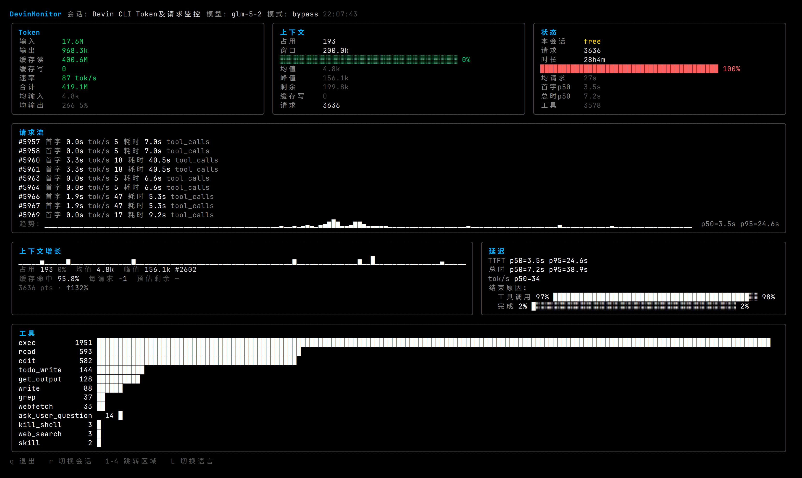
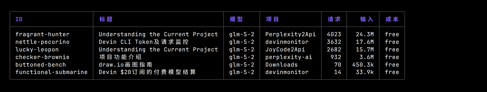
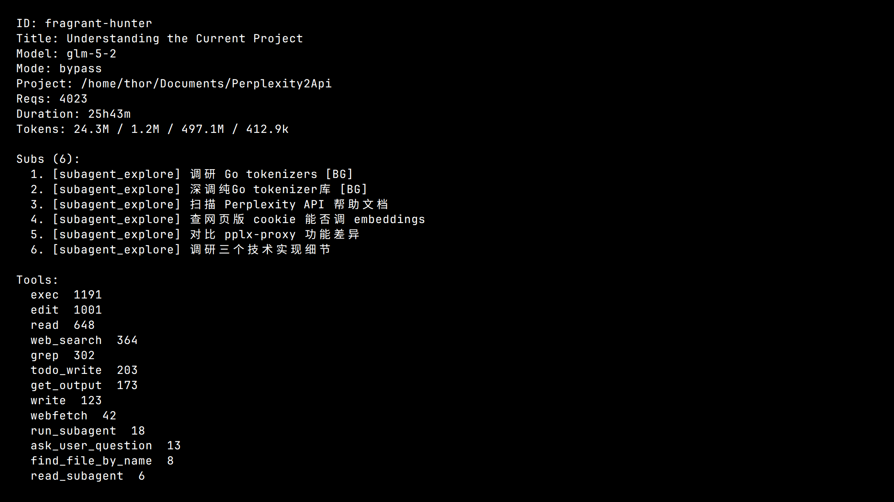
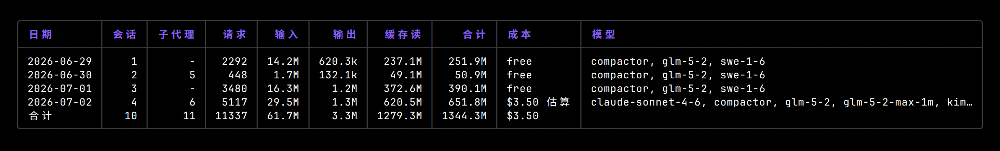
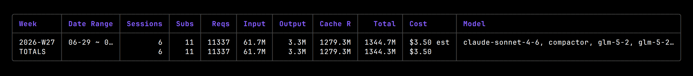
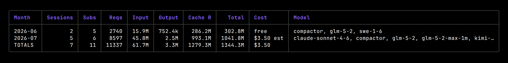
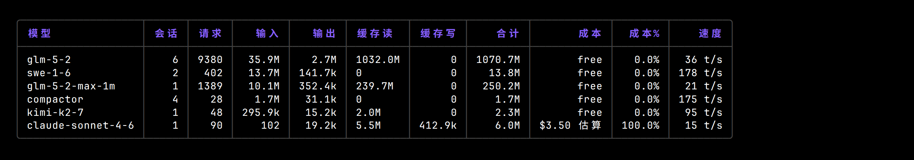
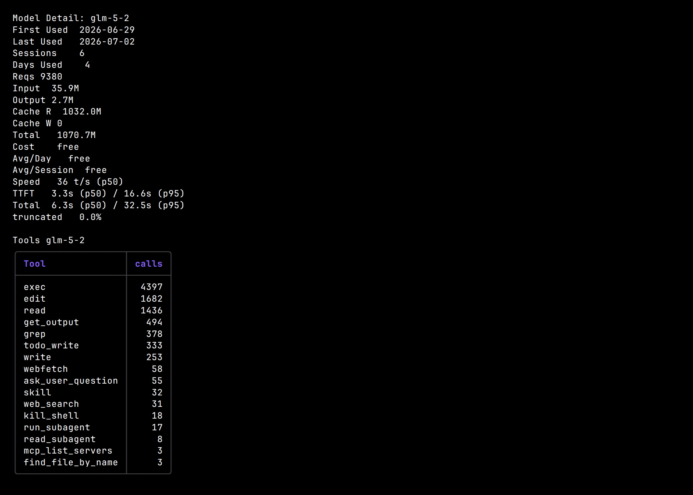
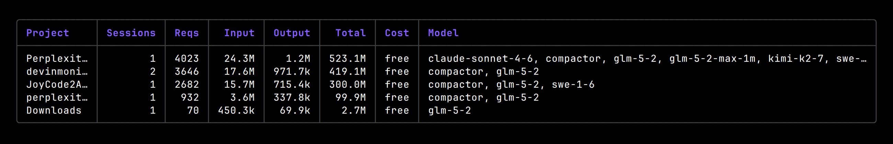
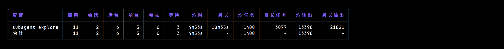

# DevinMonitor

**[Devin CLI](https://windsurf.com/devin) 的 Token 与成本监控工具。**

DevinMonitor 读取 Devin CLI 的本地会话数据库，提供实时监控、
用量报表和成本追踪——还包含其他监控工具没有的 Devin 专属指标
（TTFT、tokens/sec、finish-reason 分布、上下文增长曲线、子代理统计）。

[English](README.md)

---

## 实时面板

`live` 命令渲染一个实时 bubbletea TUI，每隔几秒轮询一次
`sessions.db`，完整展示当前会话的全景视图：



**各面板说明：**
- **Tokens** — 输入 / 输出 / 缓存读 / 缓存写总量，实时生成
  **速率**（tok/s，基于 60 秒滚动窗口汇总并发请求），以及平均值。
- **Context** — 当前上下文大小 vs. 模型窗口，填充进度条，
  平均 / 峰值 / 剩余 token 数，缓存写指示。
- **Status** — 会话成本、请求数（含子代理数）、时长、平均请求
  耗时、TTFT / 总时 p50、工具调用总数。
- **Request stream** — 最近请求的滚动列表，含 TTFT、tok/s、
  耗时和 finish reason，以及带 p50/p95 的 TTFT 趋势线。
- **Context growth** — 全会话上下文大小历史，含缓存命中率。
- **Latency** — TTFT / 总时 / tok/s 百分位和 finish-reason 分布条。
- **Tools** — 各工具调用次数及横向条形图，包含 `run_subagent`
  和 `read_subagent` 调用。

## 报表

所有报表命令渲染风格统一的表格（灰色边框 + `TOTALS` 合计行）。
列宽自适应终端——宽终端下列自动扩展，窄终端下优雅截断。

### `sessions` — 会话列表



### `session <id>` — 会话详情

展示元数据、token 明细、子代理调用列表（含 profile、任务、
前台/后台、完成状态），以及各工具调用次数明细。



### `daily` / `weekly` / `monthly` — 时间序列报表

按日 / 周 / 月汇总 token、请求、子代理和成本，并列出所用模型。
使用 `--breakdown` 可追加每模型子表。`weekly` 支持
`--start-day monday|sunday|...`。







### `models` — 模型分析

每模型的请求数、token（输入 / 输出 / 缓存读 / 缓存写）、
成本、成本占比和平均生成速度。



### `model <name>` — 模型详情

首次/末次使用、活跃天数、token 总量、成本、日均和会话均值、
p50/p95 TTFT 和总时、截断率，以及该模型的各工具明细。



### `projects` — 项目用量

按工作目录的项目名分组，展示会话数、请求数、token、成本和
所用模型。



### `agents` — 子代理使用统计

按 profile 分组的详细子代理用量：总调用数、涉及会话数、
前台/后台拆分、完成数、`read_subagent` 等待数、平均/最大时长、
平均/最大任务长度、平均/最大输出长度。



## 安装

```bash
go install github.com/garywhat/devinmonitor@latest
```

或从 [Releases](../../releases) 下载预编译二进制。

或从源码编译：
```bash
git clone https://github.com/garywhat/devinmonitor.git
cd devinmonitor
go build -o devinmonitor .
```

## 用法

```bash
# 实时面板（需要 TTY）
devinmonitor live

# 会话列表
devinmonitor sessions

# 会话详情
devinmonitor session fragrant-hunter

# 按日用量，含每模型明细
devinmonitor daily --breakdown

# 按周报表，周一起始
devinmonitor weekly --start-day monday --breakdown

# 按月报表
devinmonitor monthly

# 模型分析
devinmonitor models

# 模型详情
devinmonitor model glm-5-2

# 项目用量
devinmonitor projects

# 子代理使用统计
devinmonitor agents

# Prometheus 指标端点
devinmonitor metrics --addr :9101

# 导出标准化 JSON
devinmonitor export --detailed > usage.json
```

### 全局参数

```
--data-dir string   Devin 数据目录（默认自动探测）
--locale string     语言 en/zh（默认从系统探测）
```

### 实时面板快捷键

```
q          退出
r          切换到下一个会话
1-4 / Tab  跳转到分区（紧凑模式）
L          切换语言（en <-> zh）
```

## 响应式 TUI

实时面板根据终端尺寸自适应，共四个断点：

| 断点 | 尺寸 | 布局 |
|------|------|------|
| **Full** | >= 120 列, >= 24 行 | 完整 4 行面板 |
| **Compact** | 80-119 列 | 双列 + 标签视图 |
| **Mini** | < 80 列 | 单列流式（窄窗口 / termux） |
| **Tiny** | < 6 行 | 单行滚动条（tmux 分屏） |

窗口缩放通过 bubbletea 的 `WindowSizeMsg` 即时响应。

## 数据来源

DevinMonitor 从 Devin CLI 的数据目录读取 `sessions.db`：
- **Linux**: `~/.local/share/devin/cli/sessions.db`
- **macOS**: `~/Library/Application Support/devin/cli/sessions.db`
- **Windows**: `%APPDATA%\devin\cli\sessions.db`

可用 `--data-dir` 或 `DEVIN_DATA_DIR` 环境变量覆盖。

连接采用只读 + WAL + `query_only` 模式，不会阻塞 Devin CLI 的写入。

### Schema 适配

Devin CLI 的 SQLite schema 是内部实现细节，可能随版本变化。
`reader` 包将 schema 相关的 SQL/JSON 解析隔离在版本检测的适配器
之后。当 Devin CLI 变更 schema 时，只需新增一个适配器
（如 `v2.go`）——报表和 UI 不受影响。

## 成本计算

| 层级 | 来源 | 使用条件 |
|------|------|----------|
| 权威 | `sessions.metadata.total_credit_cost` / `total_acu_cost` | 非零（付费模型） |
| 估算 | 内置 token x 价格表 | credit 为零（免费模型） |
| 未来 | 外部定价 API（openrouter 等） | 规划中 |

免费模型（如 `glm-5-2`）在成本列显示 `free`。

## Prometheus 指标

`metrics` 命令启动一个 HTTP 服务（默认 `:9101`），暴露
Prometheus 格式的 gauge 指标：

- `devinmonitor_sessions_total`
- `devinmonitor_requests_total`
- `devinmonitor_input_tokens_total` / `devinmonitor_output_tokens_total`
- `devinmonitor_cache_read_tokens_total` / `devinmonitor_cache_write_tokens_total`
- `devinmonitor_cost_total`
- `devinmonitor_model_*` — 每模型明细
- `devinmonitor_project_*` — 每项目明细

用 Prometheus 抓取或直接 curl：
```bash
devinmonitor metrics &
curl http://localhost:9101/metrics
```

## 架构

```
sessions.db -> Reader（schema 适配器）-> 标准化 model 类型
                                       |-- Report（sessions/daily/weekly/monthly/models/projects/agents）
                                       |-- Live（bubbletea 面板）
                                       |-- Export（稳定 JSON，供 web 上传）
                                       |-- Metrics（Prometheus 端点）
```

导出格式（`export_schema: 1`）独立于 Devin 内部 schema，
设计为未来 web 分享（token 排行榜、烧钱速率对比等）的稳定契约。

## 平台与语言

- **多架构**: linux / darwin / windows x amd64 / arm64（单二进制，无 CGO）
- **i18n**: 英文 + 中文，从系统 `LANG` / `LC_ALL` 自动探测
- **CJK 渲染**: 通过 go-runewidth 正确处理字符宽度

## 技术栈

- **Go** — 单二进制，无运行时依赖
- **bubbletea + lipgloss** — 响应式 TUI 框架
- **modernc.org/sqlite** — 纯 Go SQLite（无 CGO，便于交叉编译）
- **cobra** — CLI 命令框架

## 许可证

MIT
