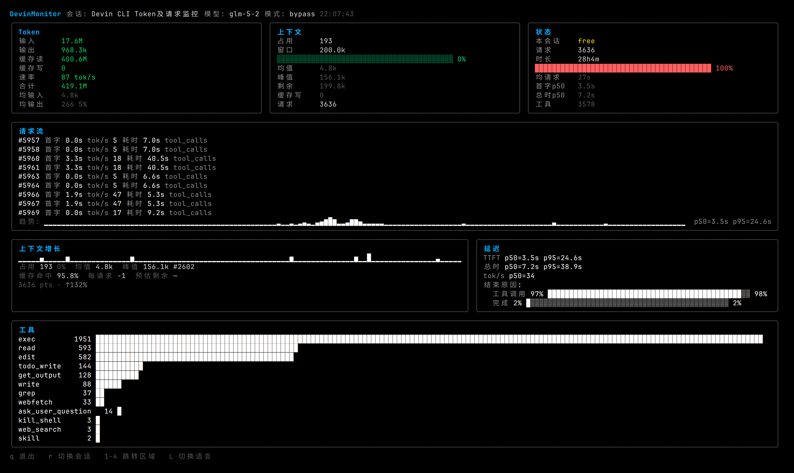
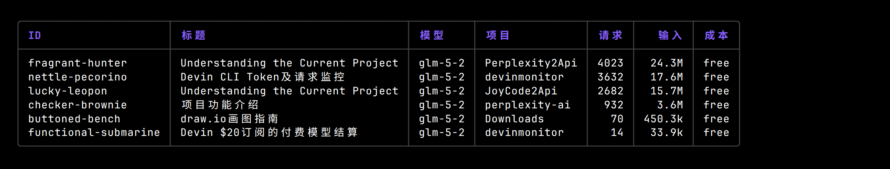
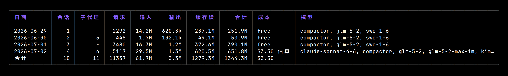

# DevinMonitor

**[Devin CLI](https://windsurf.com/devin) 的 Token 与成本监控工具。**

DevinMonitor 读取 Devin CLI 的本地会话数据库，提供实时监控、
用量报表和成本追踪——还包含其他监控工具没有的 Devin 专属指标
（TTFT、tokens/sec、finish-reason 分布、上下文增长曲线、子代理统计）。

所有数据都留在你的机器上：数据库只读打开，报表离线可用，不上传任何内容。
本地面板（`web`）只绑定回环地址；唯一会离开你机器的产物，是你主动用
`share` 生成的脱敏文件。

[English](README.md)

---

## 实时面板

`live` 命令渲染一个实时 bubbletea TUI，默认每 500 毫秒轮询一次
`sessions.db`，完整展示当前会话的全景视图：



**各面板说明：**
- **Tokens** — 输入 / 输出 / 缓存读 / 缓存写总量，实时生成
  **速率**（tok/s，基于 60 秒滚动窗口汇总并发请求），以及平均值。
- **Context** — 当前上下文大小 vs. 模型窗口，填充进度条，
  平均 / 峰值 / 剩余 token 数，缓存写指示。
- **Status** — 会话成本、请求数（含子代理数）、时长、平均请求
  耗时、TTFT / 总时 p50、工具调用总数。
- **Request stream** — 最近请求的滚动列表，含 TTFT、tok/s、
  耗时和 finish reason，以及带 p50/p95 的 TTFT 趋势线。
- **Context growth** — 全会话上下文大小历史，含缓存命中率。
- **Latency** — TTFT / 总时 / tok/s 百分位和 finish-reason 分布条。
- **Tools** — 各工具调用次数及横向条形图，包含 `run_subagent`
  和 `read_subagent` 调用。

轮询是增量的：首次加载后只重新读取消息数发生变化的会话，因此即使
在拥有数万条消息的数据库上，短间隔刷新依然轻量。

**`--interval`** 以**毫秒**设置刷新间隔（默认 `500`，最小 `100`）。
未显式传入该参数时使用配置项 `refreshInterval`；显式传入的 flag
始终优先。扩展面板（`--light` / `--once` / `--theme`）使用同一间隔。

## 报表

所有报表命令渲染风格统一的表格（灰色边框 + `TOTALS` 合计行）。
列宽自适应终端——宽终端下列自动扩展，窄终端下优雅截断。

### `sessions` — 会话列表



### `session <id>` — 会话详情

展示元数据、token 明细、子代理调用列表（含 profile、任务、
前台/后台、完成状态），以及各工具调用次数明细。


### `daily` / `weekly` / `monthly` — 时间序列报表

按日 / 周 / 月汇总 token、请求、子代理和成本，并列出所用模型。
使用 `--breakdown` 可追加每模型子表，`--last N` 只看最近 N 期
（`--last 0` 为默认值，表示全部）。`weekly` 支持
`--start-day monday|sunday|...`。




### `models` — 模型分析

每模型的请求数、token（输入 / 输出 / 缓存读 / 缓存写）、
成本、成本占比和平均生成速度。


### `model <name>` — 模型详情

首次/末次使用、活跃天数、token 总量、成本、日均和会话均值、
p50/p95 TTFT 和总时、截断率，以及该模型的各工具明细。


### `projects` — 项目用量

按工作目录的项目名分组，展示会话数、请求数、token、成本和
所用模型。


### `agents` — 子代理使用统计

按 profile 分组的详细子代理用量：总调用数、涉及会话数、
前台/后台拆分、完成数、`read_subagent` 等待数、平均/最大时长、
平均/最大任务长度、平均/最大输出长度。


### `export [report_type]` — 机器可读报表

`export` 把任意报表以四种格式写入文件或标准输出，报表类型可省略
（默认 `sessions`）：

```bash
devinmonitor export                       # sessions，完整 JSON（schema 1）
devinmonitor export daily --format csv
devinmonitor export weekly --format markdown --output weekly.md
devinmonitor export models --format html  > models.html
devinmonitor export projects --format json
```

| 报表类型 | 内容 |
|---|---|
| `sessions`（默认） | 完整标准化文档（`export_schema: 1`），面向脚本与差异对比的稳定**本地**契约 |
| `daily` / `weekly` / `monthly` | 时间分桶，含成本、token、请求数、缓存命中率 |
| `models` | 各模型总量、成本、TTFT 与吞吐百分位 |
| `projects` | 按工作目录聚合的项目用量 |
| `agents` | 按 profile 分组的子代理用量 |

格式：`csv`、`markdown`、`html`、`json`。报表类型或格式非法时以
非零退出并给出用法提示。`--detailed` 仍会在 `sessions` 文档中内嵌
逐请求明细。

### `web` — 纯本地 HTML 面板

`web` 通过 HTTP 提供实时 HTML 面板，只绑定 **`127.0.0.1`**——绝不监听
`0.0.0.0` 或任何对外地址——因此只在本机可访问，网络上不可达。它读取同一个
本地 `sessions.db`，展示成本 KPI、会话表、告警和成本图表，并通过
server-sent events 推送实时更新。它**不向任何地方发送数据**：无上传、
无托管分享、无公开排行榜、无遥测。

```bash
devinmonitor web                 # http://127.0.0.1:8080
devinmonitor web --port 9090     # 换一个回环端口
```

**`web` 与 `share` 的分工：** `web` 渲染的是未脱敏的真实数据，因此包含本机
项目路径、会话标题和会话 ID，只适合*你自己*的屏幕。要把报表发给别人，请用
`share --format html`：仅聚合数据、完全自包含，并附带脱敏清单。本机浏览用
`web`，对外发布脱敏产物用 `share`。

### `share` — 可安全发给别人的脱敏报表

`share` 输出**仅含聚合数据**的报表：不含绝对路径（项目只取路径最后一段）、
不含会话 ID、不含错误正文、不含消息内容。它会打印所应用的脱敏清单，
`--dry-run` 可在写出任何文件之前预览将被移除的内容。

```bash
devinmonitor share --dry-run                      # 先审阅脱敏项
devinmonitor share                                # JSON 输出到标准输出
devinmonitor share --output report.json           # JSON 写入文件
devinmonitor share --format html --output report.html
devinmonitor share --include-errors               # 附上错误分类计数
```

`--format html` 生成**完全自包含**的页面：内联 CSS、无 JavaScript、不引用外部
字体/图片/样式表，断网时从磁盘打开也能正常渲染。它携带与 JSON 相同的聚合数字
外加脱敏清单，收件人可据此审计哪些内容被移除了。

## 命令参考

`devinmonitor --help` 列出 12 组共 **60 个命令**；cobra 自带的 `help` 与
`completion` 不计入。本节覆盖全部 60 个：10 个重点命令单独成节，其余按组各一张表。
所有描述均来自命令自身的 `--help` 或实际运行结果。

### 先掌握这十个命令

**`filter` —— 收窄会话列表。** 按模型、项目、Agent 模式和日期筛选会话并排序：

```bash
devinmonitor filter --model swe --project api --from-date 2026-09-01 --sort cost
devinmonitor filter --exclude scratch --mode plan --json
```

`--mode` 取值 `normal`、`plan`、`bypass`；`--sort` 取值
`cost|tokens|context|duration|recent`。`--json` 输出的行与 `sessions --json` 相同。

**`cost` —— 成本总览。** `devinmonitor cost` 用一块面板给出总成本、会话数、请求数、
token 数、活跃天数、缓存拆分与涉及的模型。它没有 flag，也没有 `--json`；脚本请改读
`snapshot --json`。

**`blocks` —— 5 小时计费窗口。** `devinmonitor blocks` 按 Devin 的计费窗口
（默认 5h）聚合用量，给出每个窗口的 token、成本与 `done`/`gap` 状态，并为当前窗口
计算燃烧率与预测。

```bash
devinmonitor blocks --active          # 只看当前窗口
devinmonitor blocks --window 2h --json
```

`--since`/`--until` 接受 `YYYY-MM-DD`；`--limit-tokens` 设置当前窗口的 token 上限；
`--compact` 适配窄终端。

**`budget` —— 阈值与护栏。** `devinmonitor budget` 以仪表盘形式展示日/周/月支出相对
`config` 中预算的状态。它是告警面而非强制点：消费上限由 Devin 执行，不由本工具执行。

**`top-cost` —— 最贵的会话。** `devinmonitor top-cost --limit 20` 列出最贵的会话及其
请求数与成本；默认显示 10 个。

**`snapshot` —— 单文档状态。** `devinmonitor snapshot --json` 是机器可读状态：
`schemaVersion`、活跃会话、成本窗口、限额与明细。同一份数据可驱动状态栏或 CI 检查：

```bash
devinmonitor snapshot --compact               # 单行、无 ANSI
devinmonitor snapshot --exit-code             # 0/10/11/20/30，见下
devinmonitor snapshot --write-state           # 为面板原子写入 state 文件
```

`--statusline` 输出一行，并可从 stdin 捕获上游 `rate_limits` 负载；
`--limit-tokens` / `--limit-acu` 设置当前窗口上限。`--exit-code` 的取值：
`0` 正常，`10` 接近上限，`11` 命中上限，`20` 无法判定，`30` 无数据。

**`cache` —— 提示词缓存带来了什么。** `devinmonitor cache` 展示 cache-read /
cache-write / input token、命中率及其环形图、由此节省的成本，以及杠杆倍数
（有多少提示词量由缓存提供）。

**`optimize` —— 浪费模式。** `devinmonitor optimize --days 30` 扫描具体的浪费——
重复编辑循环、被反复读取几十次的文件、配置了却从不使用的能力——逐条给出影响与建议。
它只报告，不做任何修改。

**`backup` —— 把数据带走。** `devinmonitor backup` 把标准化数据集写成 JSON；
`devinmonitor backup --db --output sessions.db` 则复制原始 SQLite 文件。

**`trends` —— 看方向，而不只是总量。** `devinmonitor trends --range week` 绘制每日成本
图并给出距上次检查的变化量；`--days 7|30|90` 会覆盖 `--range week|month|all`。

### 机器可读输出（`--json`）

有 9 个命令提供 `--json`：

| 命令 | JSON 内容 |
|---|---|
| `sessions` | 会话行数组：`id`、`title`、`model`、`project`、`cost`、`tokens`、`duration`、`status` |
| `filter` | 筛选后的同一批会话行 |
| `search` | 命中数组：`SessionID`、`NodeID`、`Role`、`Snippet`、`Timestamp` |
| `blocks` | 计费窗口数组：`id`、`startTime`/`endTime`、`isActive`、`isGap`、`models`、`cost`、`tokens`、`totalTokens`、`nonCacheTokens`、`usedPercent` |
| `errors` | 对象：`total`、`assistantMessages`、`errorRate`、`byCategory`、`findings` |
| `report` | 对象：`Window`、`From`、`To`、`Sessions`、`Requests`、`InputTok`、`OutputTok`、`Cost`、`Daily` |
| `status` | 对象：`generated_at`、`today_cost`、`month_cost`、`cost_basis`（另有 `today_basis`/`month_basis`）、`sessions` |
| `snapshot` | 对象：`schemaVersion`、`generatedAt`、`status`、`limits`、`breakdown` |
| `alerts` | 告警数组：`kind`、`severity`、`message` |

Cost & Budget 组是缺口所在：除 `blocks` 外，`cost`、`budget`、`burn-rate`、
`projection`、`top-cost`、`plan`、`currency` 都**没有 `--json`**。脚本请改从
`snapshot --json` 读取这些数字。

### 按组划分的命令

#### 实时与 TUI

| 命令 | 用途 | 关键 flag | `--json` |
|---|---|---|---|
| `live` | 实时 bubbletea 面板；`--demo` 用合成数据运行，`--once` 只打印一帧 | `--interval`（毫秒，默认 500）、`--light`、`--theme`、`--once`、`--demo` | — |
| `theme` | 列出、切换或查看内置 TUI 配色（`list`、`set <name>`、`show`） | — | — |
| `replay` | 按时间顺序逐条回放某个会话的消息（`replay <session-id>`） | `--data-dir` | — |
| `timeline` | 某个会话事件的彩色可视化时间线（`timeline <session-id>`） | `--data-dir` | — |

#### 会话

| 命令 | 用途 | 关键 flag | `--json` |
|---|---|---|---|
| `sessions` | 会话列表，含成本与 token；`--verbose` 显示全部列 | `--sort`、`--verbose`、`--watch`、`--interval`（秒）、`--save` | ✅ |
| `session` | 单个会话详情（`session <id>`）：元数据、token 拆分、子代理调用、各工具次数 | — | — |
| `filter` | 按模型、项目、模式、日期筛选会话并排序 | `--model`、`--project`、`--exclude`、`--mode`、`--from-date`、`--to-date`、`--sort` | ✅ |
| `search` | 跨全部会话消息的全文搜索（`search <query>`） | `--limit`（默认 50） | ✅ |

#### 时间报表

| 命令 | 用途 | 关键 flag | `--json` |
|---|---|---|---|
| `daily` | 按日分桶；`--today` 与 `--watch` 提供实时视角 | `--breakdown`、`--last`、`--today`、`--watch`、`--interval`（秒） | — |
| `weekly` | 按周分桶 | `--breakdown`、`--last`、`--start-day` | — |
| `monthly` | 按月分桶 | `--breakdown`、`--last` | — |
| `24h` | 最近 24 小时的按小时活动图 | — | — |

#### 成本与预算

| 命令 | 用途 | 关键 flag | `--json` |
|---|---|---|---|
| `cost` | 成本概览：总量、会话、请求、token、活跃天数、模型 | — | — |
| `budget` | 日/周/月预算状态，含护栏与仪表盘 | — | — |
| `burn-rate` | 每小时/天/周/月的消费速率与外推 | — | — |
| `projection` | 月末支出预测、预算耗尽天数与置信度 | — | — |
| `top-cost` | 最贵的会话 | `--limit`（默认 10） | — |
| `plan` | 查看或配置 Devin 订阅套餐与 ACU 上限（`show`、`set`） | — | — |
| `currency` | 查看、设置或重置显示货币（`show`、`set <code>`、`reset`） | — | — |
| `blocks` | 按计费窗口聚合的用量，含燃烧率与预测 | `--active`、`--window`、`--since`、`--until`、`--limit-tokens`、`--compact` | ✅ |

#### 分析

| 命令 | 用途 | 关键 flag | `--json` |
|---|---|---|---|
| `cache` | 缓存命中率、效率环形图、节省与杠杆 | — | — |
| `efficiency` | Token 效率评分、输出冗余度、一次性率与生产力 | — | — |
| `tasks` | 任务类别明细（编码、调试、测试等） | — | — |
| `optimize` | 扫描浪费模式并给出优化建议 | `--days`（默认 30） | — |
| `compaction` | 从 token 数骤降检测上下文压缩事件 | — | — |
| `context` | 分析某个会话的上下文窗口被什么占用（`context <session-id>`） | — | — |
| `analytics` | 综合概览：缓存、效率、任务、浪费、压缩 | `--days` | — |
| `model-compare` | 模型横向对比：成本、token、延迟、缓存命中、速度 | — | — |
| `yield` | 有效 vs 无效消费，关联 Git 提交 | `--days`（默认 30） | — |
| `errors` | 按类别分析工具错误，可选展示样例消息 | `--examples N`、`--session` | ✅ |

#### 趋势与图表

| 命令 | 用途 | 关键 flag | `--json` |
|---|---|---|---|
| `trends` | 成本与用量趋势图 | `--range`（week/month/all）、`--days` | — |
| `heatmap` | 星期 × 小时活动热力图 | — | — |
| `calendar` | 全年贡献日历 | `--year` | — |
| `compare` | 两个时段对比，或环比上月 | `--mode`、`--current`、`--previous` | — |

#### 项目与工具

| 命令 | 用途 | 关键 flag | `--json` |
|---|---|---|---|
| `projects` | 按项目聚合：会话、请求、token、成本、模型 | `--attribution` | — |
| `project` | 单个项目下钻（`project <name>`）：按日、模型、工具分解 | `--days`（默认 30）、`--detail` | — |
| `tools` | 工具成本归因（把成本分摊到各工具） | `--session`、`--all`（默认 true） | — |
| `mcp-stats` | 按 MCP 服务器拆分用量 | — | — |
| `shell-usage` | 按命令类别统计 `exec` / `shell_command` 用量 | — | — |
| `activities` | 按活动类型（编码、调试、测试等）拆分用量 | — | — |
| `git` | 关联会话与其工作目录中的 Git 提交 | `--days`（默认 30）、`--session` | — |

#### 模型与子代理

| 命令 | 用途 | 关键 flag | `--json` |
|---|---|---|---|
| `models` | 各模型分析；`--verbose` 增加延迟列（TTFT、总时、截断率） | `--verbose` | — |
| `model` | 单个模型详情（`model <name>`）：首次/末次使用、活跃天数、p50/p95 TTFT、截断率、各工具 | — | — |
| `agents` | 按 profile 的子代理用量：调用数、前台/后台、完成数、时长、任务与输出规模 | — | — |

#### 导出与备份

| 命令 | 用途 | 关键 flag | `--json` |
|---|---|---|---|
| `export` | 把任意报表写成 `csv`、`markdown`、`html` 或 `json`（`export [report_type]`） | `--format`、`--output`、`--detailed` | JSON 本身即格式 |
| `report` | 可分享的使用报告，文本或 SVG 图表 | `--days`（默认 7）、`--month`、`--svg` | ✅ |
| `backup` | 备份全部数据：标准化 JSON，或用 `--db` 备份原始数据库 | `--db`、`--output` | — |
| `status` | 紧凑状态行、Shell 数字、原子 state 文件或终端标题 | `--compact`、`--shell`、`--json`、`--write-state`、`--state-file`、`--set-title`、`--title-format` | ✅ |
| `share` | 仅聚合数据、可安全发送的脱敏报表（见上文） | `--dry-run`、`--format`、`--output`、`--include-errors` | 默认即 JSON |

#### 集成

| 命令 | 用途 | 关键 flag | `--json` |
|---|---|---|---|
| `mcp` | stdio 上的 MCP 服务（JSON-RPC 2.0），暴露 tools 与 resources | — | MCP，而非 CLI JSON |
| `web` | 只绑定 `127.0.0.1` 的纯本地 HTML 面板（见上文） | `--port` | — |
| `notify` | 就当前告警发送桌面或 Webhook 通知（`--test` 发送测试通知） | `--test` | — |
| `snapshot` | 当前快照：活跃会话、成本、限额（见上文） | `--compact`、`--json`、`--exit-code`、`--statusline`、`--write-state`、`--limit-acu`、`--limit-tokens` | ✅ |
| `alerts` | 当前告警，面向 Agent 消费 | — | ✅ |

#### 配置与数据

| 命令 | 用途 | 关键 flag | `--json` |
|---|---|---|---|
| `config` | 查看和编辑配置（`show`、`schema`、`set <key> <value>`、`reset`、`timezone`、`reset-hour <hour>`、`model-alias`） | — | — |
| `alias` | 管理命令别名（`list`、`add <short> <long>`、`remove <short>`） | — | — |
| `pricing` | 管理每百万 token 的美元定价覆盖（`list`、`overrides`、`set <model>`、`remove <model>`、`validate`、`schema`、`fetch`、`cache`） | `--input`、`--output`、`--cache-read`、`--cache-write`、`--free`、`--file`、`--source`、`--force` | — |
| `warehouse` | 管理本地时间序列仓库（`snapshot`、`list`、`show <id>`） | — | — |

#### 系统

| 命令 | 用途 | 关键 flag | `--json` |
|---|---|---|---|
| `metrics` | Prometheus 指标端点 | `--addr`（默认 `:9101`） | Prometheus 文本格式 |
| `version` | 打印版本 | — | — |

## MCP 服务

`devinmonitor mcp` 以 stdio 运行 Model Context Protocol 服务，让
MCP 客户端（Claude Desktop、Cursor 等）直接查询本地用量数据。它
同时支持两种 stdio 帧格式——规范要求的 `Content-Length` 帧与纯
换行分隔 JSON——并支持 JSON-RPC 批量请求、通知与 `ping`。

暴露的工具：

| 工具 | 用途 |
|---|---|
| `get_sessions` | 会话列表，含成本与 token 用量 |
| `get_session` | 按 ID 查询单个会话详情 |
| `get_cost_summary` | 汇总成本（今日 / 本周 / 本月 / 总计） |
| `get_alerts` | 预算阈值与空闲会话告警 |
| `get_blocks` | 按 5 小时计费窗口分组的用量 |
| `get_limits` | 当前窗口状态、节奏与预测 |
| `compare_periods` | 对比两个时间段（默认环比上月） |
| `list_reports` | 可用报表类型与导出格式 |

协议行为由 `scripts/mcp-conformance.sh` 端到端锁定：它用规范帧格式驱动真实二进制，
覆盖 27 项用例（帧正确性、通知静默、批量、resources、全部工具）。

另外提供 `devinmonitor://` 协议下的**只读 resources**，客户端无需
调用工具即可拉取摘要：

| Resource | 内容 |
|---|---|
| `devinmonitor://summary` | 成本、token、请求与会话总量，含成本来源标注 |
| `devinmonitor://models` | 各模型用量表，含 token 占比 |
| `devinmonitor://blocks` | 当前计费窗口，含燃烧率与预测 |
| `devinmonitor://alerts` | 按类别分组的当前告警 |

```json
{
  "mcpServers": {
    "devinmonitor": { "command": "devinmonitor", "args": ["mcp"] }
  }
}
```

## 安装

```bash
go install github.com/garywhat/devinmonitor@latest
```

或从 [Releases](../../releases) 下载预编译二进制。

或从源码编译：
```bash
git clone https://github.com/garywhat/devinmonitor.git
cd devinmonitor
go build -o devinmonitor .
```

## 用法

```bash
# 实时面板（需要 TTY）
devinmonitor live

# 更快刷新：200 毫秒（毫秒为单位，最小 100）
devinmonitor live --interval 200

# 会话列表
devinmonitor sessions

# 会话详情
devinmonitor session fragrant-hunter

# 按日用量，含每模型明细
devinmonitor daily --breakdown

# 按周报表，周一起始
devinmonitor weekly --start-day monday --breakdown

# 按月报表
devinmonitor monthly

# 模型分析
devinmonitor models

# 模型详情
devinmonitor model glm-5-2

# 项目用量
devinmonitor projects

# 子代理使用统计
devinmonitor agents

# Prometheus 指标端点
devinmonitor metrics --addr :9101

# 导出标准化 JSON
devinmonitor export --detailed > usage.json

# 导出指定报表类型：sessions|daily|weekly|monthly|models|projects|agents
devinmonitor export weekly --format markdown --output weekly.md

# MCP 服务（stdio，供 Claude Desktop / Cursor 使用）
devinmonitor mcp

# 本地 Web 面板（只绑定 127.0.0.1；不发送任何数据）
devinmonitor web
```

### 全局参数

```
--data-dir string   Devin 数据目录（默认自动探测）
--locale string     语言 en/zh（默认从系统探测）
--no-cost           隐藏所有表格中的成本列（便于截图与分享）
```

`--no-cost` 是持久参数，放在子命令前后都生效：
`devinmonitor --no-cost sessions` 与 `devinmonitor sessions --no-cost` 等价。
它移除的是**表格里的成本列与成本占比列**；面板与弹窗中打印的成本数字不受影响。

### 实时面板快捷键

```
q          退出
r          切换到下一个会话
1-4 / Tab  跳转到分区（紧凑模式）
L          切换语言（en <-> zh）
```

扩展面板（`--light` / `--theme`）额外支持：

```
s          设置面板（主题、refreshInterval、预算、货币）
?          帮助浮层
Ctrl+P     命令面板
Enter      会话详情弹窗
m          模型分解弹窗
|          分屏（列表 + 详情）
v          列表 / 卡片视图切换
t          切换时间窗口（今天 / 本周 / 本月 / 全部）
l          实时日志尾部（最近消息）
```

## 升级说明 — v0.3.0

- **`live --interval` 单位改为毫秒**（原为秒）。旧的 `--interval 3`
  表示 3 秒，请改用 `--interval 3000`。最小值为 `100`，默认 `500`。
- **`refreshInterval` 配置项现在真正生效**（毫秒），在未传入
  `--interval` 时使用；其默认值由 `3` 改为 `500`。
- **`--data-dir` 成为权威路径**：指向不含 `sessions.db` 的目录时
  会明确报错退出，不再静默回退到自动探测的数据库。
- **`compare --mode` 拒绝非法值**，不再静默当作 `custom` 处理。
- `export` 支持可选报表类型（`export weekly --format csv`）；不带
  参数运行的行为保持不变。
- 子代理时长以会话生命周期为上限，不再出现荒谬的多年数值。

## 响应式 TUI

实时面板根据终端尺寸自适应，共四个断点：

| 断点 | 尺寸 | 布局 |
|------|------|------|
| **Full** | >= 120 列, >= 28 行 | 完整 4 行面板 |
| **Compact** | 80-119 列 | 双列 + 标签视图 |
| **Mini** | < 80 列 | 单列流式（窄窗口 / termux） |
| **Tiny** | < 6 行 | 单行滚动条（tmux 分屏） |

窗口缩放通过 bubbletea 的 `WindowSizeMsg` 即时响应。

## 数据来源

DevinMonitor 从 Devin CLI 的数据目录读取 `sessions.db`：
- **Linux**: `~/.local/share/devin/cli/sessions.db`
- **macOS**: `~/Library/Application Support/devin/cli/sessions.db`
- **Windows**: `%APPDATA%\devin\cli\sessions.db`

可用 `--data-dir` 或 `DEVIN_DATA_DIR` 环境变量覆盖。

连接采用只读 + WAL + `query_only` 模式，不会阻塞 Devin CLI 的写入。

### 今天读取什么、不读取什么

本工具的数字**只**来自 `sessions.db`。Devin CLI 还会写出
`transcripts/*.json`（ATIF-v1.7 轨迹，携带 `final_metrics` 与逐步 `steps`），
Devin Desktop 还可能产生 ACP 事件流。这两者目前**都尚未摄入**：它们是候选的
未来数据源，而不是当前数据源，因此这里展示的数字只反映 `sessions.db`。

### Schema 适配

Devin CLI 的 SQLite schema 是内部实现细节，可能随版本变化。
`reader` 包将 schema 相关的 SQL/JSON 解析隔离在版本检测的适配器
之后。当 Devin CLI 变更 schema 时，只需新增一个适配器
（如 `v2.go`）——报表和 UI 不受影响。

## 成本计算

| 层级 | 来源 | 使用条件 |
|------|------|----------|
| 权威 | `sessions.metadata.total_credit_cost` / `total_acu_cost` | 非零（付费模型） |
| 用户覆盖 | `<配置目录>/pricing.json` | 已为该模型设置时（优先于内置表） |
| 估算 | 内置 token x 价格表 | credit 为零（免费模型） |

免费模型（如 `glm-5-2`）在成本列显示 `free`。

定价完全在本地解析，读取时**从不联网**。若将来引入远程价格源，它必须**写入** `pricing.json`，而不是在生成报表时被查询——这样工具离线可用，「无网络」不变式也得以保持。

### 成本单位：ACU 与 token（`costBasis`）

Devin 以 **ACU**（action complexity + VM time）计费，而 ACU 与 token **没有定义上的
换算关系**——没有汇率、没有公式、无法换算。这一点在这里很重要，因为工具会输出两类
看起来相似的金额：

| 数字 | 来源 | 计量单位 |
|---|---|---|
| `sessions.metadata.total_credit_cost` / `total_acu_cost` | Devin 自己的账务，读自 `sessions.db` | provider 的 ACU / credit 口径 |
| token × 价格（内置表、`pricing.json` 或拉取的价格目录） | 我们的本地估算 | 每百万 token 的美元 |

`provenance`（`official` / `estimated` / `mixed` / `unknown`）回答的是「这是不是估算」，
**不说明**这个数字用什么单位计量。ACU 口径的数字与 token 估算的数字**不可比较**，
把两者静默混合会诱发错误对比。

相邻字段 **`costBasis`** 回答「它用什么计量」：

| 取值 | 含义 |
|---|---|
| `acu` | 该数字来自 Devin 自己的 ACU/credit 账务（`total_acu_cost` / `total_credit_cost`）；这是唯一反映 Devin 实际计费的基准 |
| `token_estimate` | 该数字是我们的算术：token 数 × 我们的模型价格表。免费或未定价的模型也归入这里——即使 Devin 报告了 token 数，该数字仍是*我们*算出 0。官方 token 数不是 ACU 口径 |
| `mixed` | 该数字把 ACU 计费与 token 估算的成本相加：同一种货币，但不是同一种单位 |
| `unavailable` | 无法确定基准（既无成本信号也无 token 数） |

`costBasis` 随数字一起传递。它出现在 `snapshot --json` 的
`breakdown.costBasis`（每模型行另有 `breakdown.byModel[].costBasis`）；`status --json`
与 `--write-state` 文件中的 `cost_basis`、`today_basis`、`month_basis`；以及 `share`
的 `usage.costBasis`，其按模型、按项目行分别在 `usage.byModel[]` /
`usage.byProject[]` 中。它与来源标注并列（快照里是 `breakdown.costProvenance`，
share 里是 `usage.costProvenance`），二者应成对解读：先看 `costBasis`（哪个单位），
再看 provenance（可信度）。消费方在比较或累加成本数字前，应先根据 `costBasis` 分支，
并把 `mixed` 视为其各部分之间明确不可比较。`export` 同样带上该标签，并按该文档的
snake_case 写法——每会话 `cost_basis`，文档级一次——与原始分量 `acu_cost` /
`credit_cost` / `estimated_cost` 并列，消费方无需自行实现「哪一个才算本会话成本」的
优先级规则；会话行永远不会是 `mixed`，因为单个会话的成本只来自一种计量。
（`backup` 包装的是同一份文档。）

有一种「看似矛盾」其实并不矛盾：在免费档机器上，基准可以如实地是 `token_estimate`，
而 provenance 显示 `unknown`——provenance 说的是「我们不为所套用的价格背书」，
基准说的是「这个数字来自我们的 token 算术，而不是 Devin 的 ACU 计量」。

面向人的输出会给每个数字打上标签，数字不会脱离单位单独出现：

| 标签 | 含义 |
|---|---|
| `[acu]` | Devin 自己的计量 |
| `[token est]` | 我们的 token 数 × 模型价格 |
| `[mixed units]` | ACU 计费与 token 估算的成本相加 |
| `[no basis]` | 无法确定基准 |

```
$ devinmonitor status
Today:     $0.00 [token est]
Month:     $0.00 [token est]
Sessions:  18
Cost basis: token est — our token counts × model prices, not Devin's meter. Devin bills in
            ACU (action complexity + VM time), a different unit with no conversion to tokens:
            do not compare a token estimate with an acu figure.
```

`status --compact` 与 `snapshot --compact` 使用同样的标签；当某个数字混合了两种计量
基准时，说明文字会标出 `MIXED UNITS`，并明确指出该数字把 ACU 计费与 token 估算的
成本加在了一起。`report` 会在 `Cost:` 行下方打印同样的说明，`share --format html`
则有「Cost basis」行，并在两张表上都带基准列。

### `config.json` 的编辑器自动补全

`devinmonitor config schema` 会打印 schema 地址、解析出的配置文件路径，以及
仓库检出时本地的 `docs/config.schema.json`。把 `$schema` 键加进 `config.json`，
编辑器即可自动补全并校验——包括主题枚举，因此未注册的配色会**在输入时就被拒绝**，
而不是被静默忽略：

```json
{ "$schema": "https://raw.githubusercontent.com/garywhat/devinmonitor/main/docs/config.schema.json" }
```

该 schema 禁止未知键，因此拼错会立刻报错。`pricing.json` 有自己独立的 schema。

### 远程价格目录（需手动开启）

`devinmonitor pricing fetch` 会下载公开的模型价格目录（默认 OpenRouter 的模型
列表）并缓存到 `<配置目录>/pricing.cache.json`，供离线使用。三个关键性质：

- **默认关闭**：除非你执行 `pricing fetch`，或设置 `config set pricingAutoFetch true`
  （最多每 24 小时刷新一次），否则不会访问网络。
- **只下载**：请求是一个获取公开价格列表的裸 `GET`，不发送任何用量数据、模型名或路径。
- **读取时绝不联网**：价格始终从本地文件解析。

优先级为 **你的 `pricing.json` > 拉取的缓存 > 内置表**，因此刷新永远不会覆盖你
手动设置的价格——缓存单独成文件正是为此。`pricing cache` 查看缓存状态，
`DEVINMONITOR_OFFLINE=1` 可完全禁止拉取。

## Prometheus 指标

`metrics` 命令启动一个 HTTP 服务（默认 `:9101`），暴露
Prometheus 格式的 gauge 指标：

- `devinmonitor_sessions_total`
- `devinmonitor_requests_total`
- `devinmonitor_input_tokens_total` / `devinmonitor_output_tokens_total`
- `devinmonitor_cache_read_tokens_total` / `devinmonitor_cache_write_tokens_total`
- `devinmonitor_cost_total`
- `devinmonitor_model_*` — 每模型明细
- `devinmonitor_project_*` — 每项目明细

用 Prometheus 抓取或直接 curl：
```bash
devinmonitor metrics &
curl http://localhost:9101/metrics
```

## 架构

```
sessions.db -> Reader（schema 适配器）-> 标准化 model 类型
                                       |-- Report（sessions/daily/weekly/monthly/models/projects/agents）
                                       |-- Live（bubbletea 面板）
                                       |-- Export（稳定的本地 JSON 契约）
                                       |-- Web（只绑定回环地址的 HTML 面板）
                                       |-- Metrics（Prometheus 端点）
```

导出格式（`export_schema: 1`）独立于 Devin 内部 schema，被设计为脚本、CI
和两期对比所使用的稳定**本地**契约，而不是上传格式。DevinMonitor 不会把用量
数据发往任何地方。要把报表交给别人，请使用上文所述的脱敏 `share` 产物。

## 与其他工具的对比

DevinMonitor 是面向 Devin 的专用仪器，而不是覆盖多 Agent 的宽口径跟踪器。
下面这些项目在各自领域做得很好——其中几个也读取 Devin 数据——因此这里说的
差异是范围与深度的差异，而不是质量高低。

| 工具 | 它做什么 | 我们不同在哪 |
|---|---|---|
| [ccusage](https://github.com/ccusage/ccusage) | 覆盖 18 个 Agent CLI 的本地 token/成本报表，提供 `daily`/`weekly`/`monthly`/`session`/`blocks` 子命令与 `--json` | 它覆盖很多 Agent，我们只读 Devin。我们补充了 Devin 专属的延迟指标（TTFT、tokens/sec 百分位）、finish-reason 与按工具的成本归因，这些不在它文档化的报表集合中 |
| [tokscale](https://github.com/junhoyeo/tokscale) | 覆盖 50+ Agent 的 TUI 与 Web 贡献图，其中包含通过 `~/.local/share/devin/cli/sessions.db` 与 Devin Desktop ACP 事件读取 Devin CLI；可选 `submit` 上传到全球排行榜 | 它已经在读我们读的同一个数据库。我们在这一份数据源上做得更深（延迟/吞吐分布、上下文增长、子代理统计），并且刻意不提供排行榜或任何上传路径 |
| [codeburn](https://github.com/getagentseal/codeburn) | 覆盖 40 个工具，含终端、桌面、菜单栏与浏览器界面、MCP 工具、`quota` 命令与局域网多机合并；其 [Devin provider 说明](https://github.com/getagentseal/codeburn/blob/main/docs/providers/devin.md) 以 `transcripts/*.json` 为用量主源、`sessions.db` 仅作补充 | 它的广度大得多，而且已经摄入 Devin transcript，我们尚未做到。我们是单个静态二进制、无账号、无 GUI，提供带可审计脱敏清单的 `share` 产物，而不是托管看板 |
| [sniffly](https://github.com/chiphuyen/sniffly) | Claude Code 日志的 Web 分析，含错误分类与一键分享链接（[sniffly.dev](https://sniffly.dev)） | 它面向 Claude Code，我们面向 Devin。它的分享是托管链接（私有或公开画廊）；我们始终是本地文件加一份可检查的脱敏清单 |
| [Claude-Code-Usage-Monitor](https://github.com/Maciek-roboblog/Claude-Code-Usage-Monitor) | 实时 Claude Code 监视器，读取 provider 自己的 `rate_limits`，维护持久 warehouse，支持 `--once --output json` 与语义退出码 | 它能信任官方窗口数据；我们的数字由本地数据推导，并带成本来源标注（`official`/`estimated`/`unknown`）。我们补充了 Devin 指标，以及它未文档化的 MCP 接口 |
| [devin-usage](https://github.com/Meltemi-Q/devin-usage) | Devin 专项：其 README 记录了通过 Devin 未公开的 web/API 接口读取服务端 seat 配额与组织 ACU 消耗，并配合本地 `sessions.db` 指标 | 它报告的是我们给不出的配额真相：我们的窗口与成本均由本地数据推导并如实标注。它的配额来自其 README 自己都标注为易变的逆向接口，因此我们只把它当作可选的未来方向，而非默认路径 |

我们在 Devin 深度上的具体优势：TTFT 与 tokens/sec 百分位、finish-reason
分布、含缓存命中率的上下文增长、子代理调用统计、带燃烧率与预测的 5 小时计费
窗口、每个成本数字都带来源标注、8 个 MCP 工具 + 4 个只读 resource、供脚本
使用的语义退出码，以及带脱敏清单的 `share` 产物。以上全部本地完成：无账号、
无上传、无遥测。

如实承认我们没有的：

- **多 Agent 广度。** ccusage（18 个来源）、tokscale（50+）与 codeburn
  （40 个工具）覆盖众多 CLI；DevinMonitor 只读 Devin。
- **Transcript 摄入。** codeburn 以 Devin 的 ATIF transcript
  （`~/.local/share/devin/cli/transcripts/*.json`）作为用量主源。我们今天
  只读 `sessions.db`，尚未摄入 transcript 或 ACP 事件。
- **桌面与菜单栏界面。** codeburn 提供桌面、菜单栏与浏览器界面；
  DevinMonitor 是 CLI/TUI 加机器可读接口。
- **服务端配额真相。** Claude-Code-Usage-Monitor 能读取 provider 自己的
  限额窗口，devin-usage 的 README 也记录了读取 Devin 自身的 seat 配额与
  ACU 消耗；我们没有 Devin 服务端配额来源，也不会为此传输凭证。

以上对比中的每条声明均以上方链接为来源。

## 平台与语言

- **多架构**: linux / darwin / windows x amd64 / arm64（单二进制，无 CGO）
- **i18n**: 英文 + 中文，从系统 `LANG` / `LC_ALL` 自动探测
- **CJK 渲染**: 通过 go-runewidth 正确处理字符宽度

## 技术栈

- **Go** — 单二进制，无运行时依赖
- **bubbletea + lipgloss** — 响应式 TUI 框架
- **modernc.org/sqlite** — 纯 Go SQLite（无 CGO，便于交叉编译）
- **cobra** — CLI 命令框架

## 许可证

MIT
